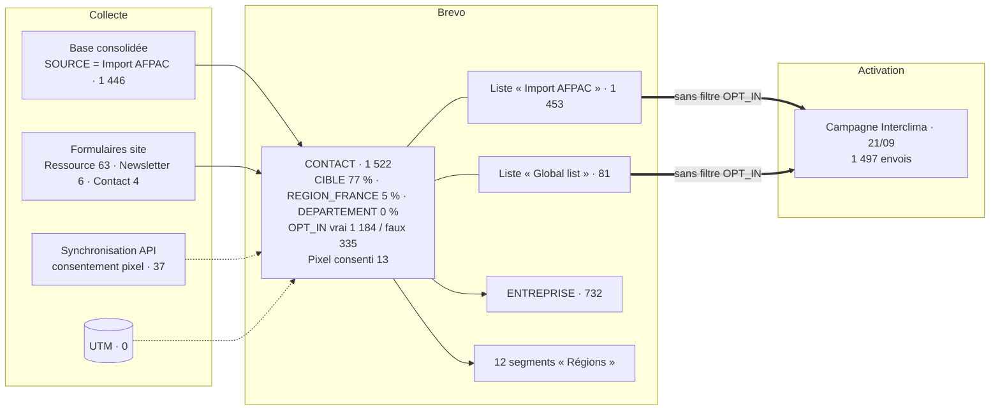
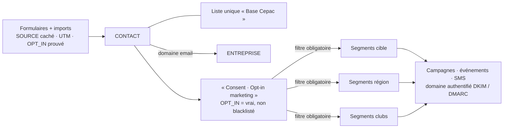

# Documentation CRM Brevo — CEPAC

| | |
|---|---|
| **Client** | CEPAC |
| **Rédaction** | Digitalised — William Borges (consultant CRM / chef de projet) |
| **Version** | v1.0 — 24/09/2026 |
| **Outil** | Brevo (ex-Sendinblue) |
| **Source des constats** | Extraction du compte Brevo en lecture seule, le 24/09/2026 (API Brevo v3, script `scripts/extract_brevo_config.py`) |

> **Méthode et limites**
> Les constats proviennent d'une extraction automatique **en lecture seule** : aucune donnée n'a été créée, modifiée ou envoyée. Seuls des volumes agrégés figurent ici, sans aucune donnée personnelle.
> Trois éléments ne sont pas exposés par l'API Brevo : **les conditions et volumes des segments, les formulaires, les workflows**. Ils sont marqués **« À relever dans l'interface »**.
> Certaines conclusions sont des **déductions** faites à partir de concordances de chiffres. Elles sont signalées comme telles.

---

## 0. Synthèse

**État global** : le compte est opérationnel. Il compte **1 522 contacts** (dont 1 184 marqués opt-in), **732 fiches Entreprise**, et une première campagne a été envoyée à 1 497 destinataires, avec de bons taux d'engagement. La structure de qualification est posée : `CIBLE` renseignée à 77 %, valeurs figées, consentement pixel natif. En revanche, **la conformité RGPD, la délivrabilité et la segmentation** demandent des corrections avant le prochain envoi.

### 🔴 Alertes, à traiter avant tout nouvel envoi

| # | Alerte | Constat |
|---|---|---|
| 1 | **Les soft opt-ins ambigus sont codés comme opt-ins** | 1 110 contacts importés ont `OPT_IN = vrai`. Ce chiffre correspond presque exactement aux 125 opt-ins explicites + 984 soft opt-ins ambigus de la consolidation (1 109). *Déduction* : les ~984 soft opt-ins Memopac ont été importés comme consentements valides, sans qu'on puisse les distinguer des opt-ins explicites. |
| 2 | **La campagne Interclima a été envoyée sans filtre de consentement** | Envoyée le 21/09/2026 aux deux listes entières : 1 497 envois, aucun segment, aucune exclusion. Les **335 contacts `OPT_IN = faux`** figuraient dans les listes ciblées. |
| 3 | **Les refus explicites n'étaient pas bloqués** | Les 84 contacts blacklistés correspondent exactement aux **73 hard bounces + 11 désinscriptions** de la campagne. *Déduction* : aucun contact n'était blacklisté avant l'envoi, donc les 8 refus explicites de la consolidation n'avaient pas été bloqués. |
| 4 | **Le domaine d'envoi n'est pas authentifié** | `cepac-experts.org` (hébergé chez OVH) est **non vérifié et non authentifié** (pas de DKIM ni de DMARC via Brevo). Gmail et Yahoo l'exigent depuis 2024. |
| 5 | **Taux de hard bounce élevé** | 4,9 % (73 sur 1 497). Le seuil de vigilance habituel est 2 %. La base contient des adresses obsolètes (historique AFPAC). |
| 6 | **Suivi des ouvertures sans consentement probable** | Seuls **13 contacts** ont consenti au pixel. Pourtant **522 contacts** ont une date de dernière ouverture enregistrée, et la campagne compte 439 ouvertures « traçables ». *Déduction* : le compte suit les ouvertures des contacts dont le consentement n'est pas renseigné. À vérifier dans le paramétrage du consentement au suivi. |

### Points clés

| | Constat |
|---|---|
| ✅ | `CIBLE` renseignée pour **1 168 contacts (77 %)**, sur 5 valeurs figées. Le KPI 2026 de 1 000 contacts qualifiés est atteint en volume |
| ✅ | `SOURCE` en Choix multiple, avec 4 options dont **« Newsletter »** |
| ✅ | Consentement pixel géré par la **fonction native Brevo**, avec traçabilité de l'origine. Campagne conforme sur le contenu : bloc conditionnel, balise de révocation, désinscription |
| ✅ | Première campagne : **47,6 % d'ouverture**, 0,8 % de désinscription, 0 plainte |
| ✅ | Objet Entreprise en place : **732 fiches**, domaine, typologie sur 25 métiers |
| ⚠️ | **Localisation quasi absente** : région renseignée pour 72 contacts (4,7 %), département pour aucun. Les clubs régionaux ne sont pas activables en l'état |
| ⚠️ | Pas de liste unique « Base Cepac », mais deux listes. **Aucun segment par cible ni de consentement.** 12 segments régionaux, dont 5 sur des régions à 0 contact, alors que l'Île-de-France (29 contacts, 1ʳᵉ région) n'en a pas |
| ⚠️ | `DEPARTEMENT` est de type nombre. `TELECHARGEMENT_RESSOURCE` est en texte libre. `DOUBLE_OPT-IN` n'est jamais renseigné. `SOUS_CIBLE` n'est pas paramétré |
| ⚠️ | **Aucun UTM renseigné** sur les contacts |

---

## 1. Contexte et objectifs du CRM

La feuille de route communication 2026/2027 de CEPAC fixe un objectif : **« Transformer la communauté en capital relationnel »**, c'est-à-dire passer d'une logique de diffusion à une logique de relation directe et de mobilisation de l'écosystème.

**Cas d'usage attendus** : segmentation (fonction, entreprise, organisations professionnelles, collectivités, acteurs public-privé type offices HLM) ; newsletters générales ou segmentées et SMS ; invitations aux événements et follow-up ; animation de clubs par région et/ou par métier ; suivi one-to-one ; capture de la donnée de visite liée à la création de comptes ; parrainage et partenaires ; **conformité RGPD stricte**.

**Volumétrie** : KPI 2026 = 1 000 contacts qualifiés. Moins de 10 000 contacts à terme, et jusqu'à 100 000 si tout le réseau est touché.

**Sources de contacts** : abonnés LinkedIn AFPAC, téléchargements (Memopac), webinaires, partenariats (France Rénov', bailleurs sociaux), cold mails, livres blancs, Google Ads et LinkedIn Ads.

**Pourquoi Brevo ?** CEPAC n'a ni activité B2C ni besoin de pilotage commercial (pipeline, tâches). Le besoin est un **embasement qualifié avec nurturing par cible**. Un outil de marketing automation y répond mieux qu'un CRM commercial type HubSpot : licences moins chères, paramétrage plus léger, meilleure adéquation.

**Intervenants** : CEPAC (Vincent Teillet), Digitalised (Julien Beltran, William Borges), Tribu (site web et formulaires).

### Compte Brevo

| Élément | Valeur |
|---|---|
| Abonnement | Actif, quota de **13 496 envois** sur la période du 20/09 au 20/10/2026 |
| Marketing Automation | Activé |
| Expéditeur | « CEPAC », sur le domaine `cepac-experts.org` (actif) |
| Domaine d'envoi | `cepac-experts.org`, fournisseur DNS OVH. **Non vérifié, non authentifié** |

---

## 2. Architecture

### 2.1 Principes cibles et statut

| # | Principe | Statut constaté |
|---|---|---|
| 1 | Une seule liste globale **« Base Cepac »**, qui porte uniquement le consentement | ⚠️ Deux listes, « Import AFPAC » (1 453) et « Global list » (81). Le consentement est porté par l'attribut `OPT_IN`, pas par la liste |
| 2 | Tout le ciblage passe par des **segments dynamiques** | ⚠️ 12 segments régionaux seulement. La campagne a ciblé des listes |
| 3 | **Valeurs figées** pour `CIBLE` et la région | ✅ Choix multiple à valeurs figées |
| 4 | **`SOURCE`** en champ caché, alimenté automatiquement | ✅ Attribut conforme, renseigné à 99,8 % |
| 5 | Deux objets **Contact** / **Entreprise**, localisation portée par le contact | ✅ Objets en place. ⚠️ Localisation du contact renseignée à 4,7 % |
| 6 | **Choix multiple** pour les champs multi-valeurs | ⚠️ Oui pour `SOURCE`, non pour `TELECHARGEMENT_RESSOURCE` |

### 2.2 Architecture constatée



### 2.3 Architecture cible



---

## 3. Dictionnaire des attributs

### 3.1 Objet Contact — attributs métier

| Attribut attendu | Attribut réel | Type réel | Valeurs configurées | Remplissage | Statut |
|---|---|---|---|---|---|
| `EMAIL`, `PRENOM`, `NOM` | idem | Standard / texte | — | — | ✅ |
| `POSTE` | `JOB_TITLE` (natif) | Texte | — | 1 | ⚠️ Donnée quasi absente |
| `CIBLE` | `CIBLE` | **Choix multiple** | Exploitant, Installateur, Prescripteur, Institution / Presse, En formation | **1 168 (77 %)**. Aucun contact n'a plusieurs cibles | ✅ |
| `SOUS_CIBLE` | `SOUS_CIBLE` | Catégorie | **Une seule valeur fictive : « sous cible 1 »** | 0 | ❌ À paramétrer |
| `DEPARTEMENT` | `DEPARTEMENT` | **Nombre** | — | 0 | ❌ Type inadapté (01, 2A, 2B, 971…) |
| `REGION` | `REGION_FRANCE` | **Choix multiple** | 13 régions métropolitaines + 5 DROM | **72 (4,7 %)** | ✅ Structure. ⚠️ Remplissage |
| `ETABLISSEMENT` | — | — | — | — | ❌ Absent |
| `NIVEAU_FORMATION` | — | — | — | — | ❌ Absent |
| `SOURCE` | `SOURCE` | Choix multiple | Formulaire Contact, Formulaire Ressource, Import AFPAC, Newsletter | 1 519 (99,8 %) | ✅ |
| `TELECHARGEMENT_RESSOURCE` | idem | **Texte** | Valeurs séparées par des virgules, 18 combinaisons | 1 391 (91 %) | ⚠️ À convertir en Choix multiple |
| `CANAL_ORIGINE` | — | — | — | — | ❌ Absent (redondant avec `SOURCE` et UTM : à arbitrer) |
| `CONSENT_MARKETING` | **`OPT_IN`** | Booléen | vrai / faux | vrai **1 184** · faux **335** · vide 3 | ⚠️ Mélange opt-ins explicites et soft opt-ins |
| — | `DOUBLE_OPT-IN` | Catégorie | Yes / No | **0** | ❌ Inutilisé : à supprimer ou à réserver à la requalification |
| `PIXEL_TRACKING_CONSENT` | `_PIXEL_TRACKING_CONSENT` (natif) | Booléen | vrai / faux | vrai **13** · faux **24** · vide 1 485 | ✅ Structure |
| `PIXEL_TRACKING_CONSENT_DATE` | `_PIXEL_TRACKING_CONSENT_DATE` (natif) | Date | — | 37 | ✅ Preuve horodatée |
| *(bonus)* | `_PIXEL_TRACKING_CONSENT_SOURCE` (natif) | Catégorie | form, api, import, revocation_link, manual | api **36** · revocation_link **1** | ✅ Traçabilité de l'origine |
| `UTM_SOURCE`, `UTM_MEDIUM`, `UTM_CAMPAIGN` | idem | Texte | — | **0** | ⚠️ Tracking non opérationnel |

**Note sur le type Choix multiple de `CIBLE` et `REGION_FRANCE`** : les valeurs sont bien figées, ce qui était l'objectif. Changer de type obligerait à recréer l'attribut et à tout réimporter. **Recommandation : conserver ce type**, avec la règle de gouvernance « une seule valeur par contact » (§12).

**Note sur `DEPARTEMENT`** : en type nombre, « 01 » devient « 1 », et « 2A », « 2B » sont impossibles. L'attribut est vide : c'est le bon moment pour **le recréer en Catégorie** (liste des départements, DROM compris).

**Note sur le pixel** : 36 consentements ont été enregistrés par **API** (vraisemblablement la synchronisation des formulaires du site) et 1 révocation via le lien dans l'email. Le dispositif fonctionne de bout en bout.

### 3.2 Objet Contact — autres attributs

| Attribut | Type | Remplissage | Commentaire |
|---|---|---|---|
| `COMPANY_NAME` | Texte | 244 | Nom d'entreprise saisi. Source utile pour le rattachement Entreprise |
| `MESSAGE` | Texte | 4 | Message libre du formulaire de contact. **Minimisation RGPD** : définir une durée de conservation |
| `TEST_FONCTIONNEL` | Booléen | 0 | Attribut de test, **à supprimer** |
| `_LAST_EMAIL_OPEN_DATE` | Date (natif) | 522 | Voir l'alerte n° 6 (suivi sans consentement) |
| `SMS`, `WHATSAPP`, `LANDLINE_NUMBER`, `LINKEDIN`, `EXT_ID`, `CONTACT_TIMEZONE` | Natifs | — | — |
| `BLACKLIST`, `READERS`, `CLICKERS`, `_DETECTED_LANGUAGE` | Natifs / calculés | — | Gérés par Brevo |

### 3.3 Objet Entreprise

**732 fiches Entreprise.**

| Attribut attendu | Attribut réel | Type | Commentaire | Statut |
|---|---|---|---|---|
| Nom | `name` | Texte | Natif | ✅ |
| `DOMAINE` | `domain` | Texte | Natif : clé de rapprochement | ✅ |
| `SECTEUR` | `domaine_d_expertise` | Choix unique, **25 valeurs** | Administration, Apprenti, Association / Organisation professionnelle, Architecte, Assurance, Bailleurs, Bureau d'étude, Collectivité locale, Constructeur maisons individuelles, Diagnostiqueur, Économiste, Enseignant, Expertise, Énergéticien, Formateur, Industriel fabricant, Installateur, Ingénieur conseil, Lotisseur, Mainteneur, Maîtrise d'ouvrage, Organisme technique ou scientifique, Presse, Promoteur, Syndic copropriété | ✅ |
| `REGION_SIEGE` | `departement_entreprise` | Texte | Département du siège | ⚠️ Texte libre : imposer un format |
| — | `website`, `linkedin`, `industry`, `number_of_employees`, `revenue`, `phone_number`, `owner` | Natifs | Propriétaire unique : une adresse générique CEPAC | — |

**Points d'attention**

- La valeur « Administration » a pour clé technique `test` : c'est un résidu de paramétrage, à corriger si possible.
- Plusieurs valeurs décrivent des **personnes** (Apprenti, Enseignant, Formateur, Architecte) et recoupent la future `SOUS_CIBLE`. **Recommandation** : s'en servir pour définir les valeurs de `SOUS_CIBLE` (par exemple, Prescripteur donne Architecte, Bureau d'étude, Économiste, Ingénieur conseil…), et garder côté Entreprise la typologie d'organisation.
- 732 fiches pour 1 522 contacts, dont 244 ont un nom d'entreprise saisi. La méthode de création (domaine email ou nom saisi) est à confirmer, et **les fiches sur domaines génériques** (gmail.com, orange.fr, hotmail.fr, free.fr, wanadoo.fr, outlook.fr, laposte.net…) sont à contrôler et à supprimer.

---

## 4. Listes et segments

### 4.1 Listes

| Dossier | Liste | Contacts | Dont blacklistés | Dont `OPT_IN = faux` |
|---|---|---|---|---|
| Your first folder | **Import AFPAC** (id 8) | 1 453 (dont 1 440 uniquement dans celle-ci) | 81 | 335 |
| Your first folder | **Global list** (id 2) | 81 (dont 68 uniquement dans celle-ci) | 2 | 0 |
| Contacts des conversations | Contacts impliqués dans les conversations (id 7) | 1 | 1 | — |
| marketing_automation | identified_contacts (id 3) | 0 | — | — |

13 contacts sont dans les deux listes principales, et tous les contacts appartiennent à au moins une liste.

**Lecture** : « Import AFPAC » contient la base consolidée des 8 exports du site. Malgré son nom, ce n'est pas la base historique AFPAC (abonnés LinkedIn…). « Global list » contient des contacts qui sont tous en opt-in, sans doute issus des formulaires.

**Recommandation** : fusionner les deux listes dans **« Base Cepac »**, renommer le dossier « Your first folder » en « CEPAC », et ne plus cibler que des segments.

### 4.2 Segments existants

12 segments, catégorie **« Régions »**, créés le 10/09/2026. Leurs conditions et volumes sont **à relever dans l'interface**. Le tableau ci-dessous indique le nombre de contacts portant la région correspondante dans `REGION_FRANCE`.

| Région (valeur d'attribut) | Contacts | Segment |
|---|---|---|
| Île-de-France | **29** | ❌ **Absent** |
| Auvergne-Rhône-Alpes | 10 | ✅ « Auvergne-Rhone-Alpes » |
| Grand Est | 7 | ✅ « Grand-Est » |
| Bretagne | 6 | ✅ |
| Nouvelle-Aquitaine | 4 | ❌ Absent |
| Bourgogne-Franche-Comté | 3 | ✅ « Bourgogne-Franche-Compté » |
| Pays de la Loire | 3 | ❌ Absent |
| Normandie | 2 | ❌ Absent |
| Provence-Alpes-Côte d'Azur | 2 | ❌ Absent |
| Guyane | 2 | ✅ |
| La Réunion | 2 | ✅ |
| Occitanie | 1 | ❌ Absent |
| Hauts-de-France | 1 | ✅ « Haut-de-France » |
| Centre-Val de Loire | 0 | ✅ « Centre-Val-de-loire » |
| Corse | 0 | ✅ |
| Guadeloupe | 0 | ✅ |
| Martinique | 0 | ✅ |
| Mayotte | 0 | ✅ |

**Constats** : les segments ont été créés à peu près dans l'ordre alphabétique, jusqu'à Mayotte. L'Île-de-France a été sautée, et la série s'arrête avant Normandie. Les 6 régions manquantes incluent donc l'Île-de-France, la plus représentée. Les noms de plusieurs segments diffèrent des libellés de l'attribut : sans impact si la condition est correcte, mais à harmoniser.

### 4.3 Potentiel des clubs (cible × région)

Le croisement le plus fourni compte **15 contacts** (Prescripteurs en Île-de-France). Viennent ensuite Prescripteurs en Auvergne-Rhône-Alpes (7) et En formation en Île-de-France (6). Tous les autres croisements comptent 4 contacts ou moins. **Les clubs régionaux par métier ne sont pas activables tant que la localisation n'est pas collectée** (§6.4).

### 4.4 Segments à créer

| Famille | Condition | Volume estimé | Cas d'usage | Priorité |
|---|---|---|---|---|
| **`[Consent] Opt-in marketing`** | `OPT_IN = vrai` ET non blacklisté *(puis, après requalification, opt-in confirmé uniquement)* | 1 123 aujourd'hui | **Filtre obligatoire de tout envoi marketing** | 🔴 |
| `[Consent] Sans opt-in` | `OPT_IN = faux` ou vide | 338 | Exclusion systématique | 🔴 |
| `[Cible] …` (×5) | `CIBLE contient …` | 101 à 619 | Newsletters ciblées | Haute |
| `[Région] …` manquants (×6) | `REGION_FRANCE contient …` | 1 à 29 | Événements régionaux | Moyenne |
| `[Qualif] Sans cible` | `CIBLE est vide` | 354 | Campagne de qualification | Moyenne |
| `[Qualif] Sans région` | `REGION_FRANCE est vide` | 1 450 | Campagne de collecte de la localisation | Haute |
| `[Ressource] …` | `TELECHARGEMENT_RESSOURCE contient …` | 14 à 482 | Nurturing | Moyenne |
| `[Club] Cible × Région` | `CIBLE` ET `REGION_FRANCE` | ≤ 15 | Clubs | Après collecte de la localisation |

**Convention de nommage** : `[Famille] Libellé`, la famille servant aussi de catégorie de segment dans Brevo.

---

## 5. Consentement et conformité RGPD / CNIL

### 5.1 Opt-in marketing

**Référence (consolidation de la base)** : environ 125 opt-ins explicites, 984 soft opt-ins ambigus (Memopac), 341 sans opt-in, 8 refus explicites, 1 conflit.

**Constaté dans Brevo** (attribut `OPT_IN`)

| Source | `OPT_IN = vrai` | `OPT_IN = faux` | Vide |
|---|---|---|---|
| Import AFPAC (base consolidée) | **1 110** | **335** | 1 |
| Formulaire Ressource | 63 | — | — |
| Newsletter | 6 | — | — |
| Formulaire Contact | 4 | — | — |
| Sans source | 1 | — | 2 |
| **Total** | **1 184** | **335** | **3** |

**Analyse**

- **1 110 opt-ins importés ≈ 125 explicites + 984 soft opt-ins (1 109).** *Déduction* : les soft opt-ins ambigus ont été importés comme opt-ins valides. Le brief prévoyait l'inverse (pas d'envoi avant requalification).
- **335 `OPT_IN = faux`** ≈ 341 sans opt-in, plus ou moins les refus. Ces contacts sont restés dans la liste d'envoi.
- **Les 8 refus explicites ne sont pas identifiables.** Aucun contact n'était blacklisté avant la campagne : les 84 blacklistés d'aujourd'hui correspondent exactement aux 73 hard bounces et 11 désinscriptions de l'envoi.
- **`DOUBLE_OPT-IN` n'est renseigné pour aucun contact.**

**Actions recommandées**

1. **Retrouver dans le fichier de consolidation** les contacts classés soft opt-in, sans opt-in et refus, et les requalifier dans Brevo :
   - refus explicites : **blacklistés** ;
   - sans opt-in : `OPT_IN = faux` (déjà le cas pour 335 contacts) ;
   - soft opt-ins : repasser `OPT_IN` à « non confirmé ». Ce point est à arbitrer, par exemple via `DOUBLE_OPT-IN = No` ou une nouvelle valeur.
2. **Créer `[Consent] Opt-in marketing`** et l'imposer à tout envoi (§12).
3. **Campagne de requalification** des soft opt-ins : message unique « Souhaitez-vous continuer à recevoir les informations CEPAC ? », avec confirmation en double opt-in. Les contacts qui confirment passent `DOUBLE_OPT-IN = Yes` ; ceux qui ne répondent pas sortent du ciblage marketing après un délai défini. À valider juridiquement par CEPAC.
4. **Documenter la campagne Interclima** dans le registre des traitements : date, volume, fondement retenu. Ne pas renouveler ce type d'envoi tant que les points 1 et 2 ne sont pas faits.

### 5.2 Pixel de tracking des ouvertures

| Point | Constat |
|---|---|
| Fonction native de consentement au pixel | ✅ Active (attributs `_PIXEL_TRACKING_CONSENT`, `_DATE`, `_SOURCE`) |
| Consentements enregistrés | 37 réponses : **13 acceptations**, 24 refus. 36 via API, 1 révocation via le lien de l'email |
| Campagne Interclima | ✅ Bloc conditionnel, balise `{{ revoke_open_pixel_tracking }}`, lien de désinscription |
| Template « Invitation Salon » (inactif) | ⚠️ Balise présente, **bloc conditionnel absent** |
| **Suivi effectif des ouvertures** | 🔴 **522 contacts** ont une date de dernière ouverture, et la campagne compte 439 ouvertures traçables, **alors que 13 contacts seulement ont consenti** |

**Action prioritaire** : vérifier dans Brevo le **paramétrage du consentement au suivi des ouvertures**, en particulier le comportement pour les contacts **sans valeur de consentement** (1 485). Pour respecter les recommandations CNIL, le suivi doit être désactivé par défaut et activé uniquement pour les contacts ayant consenti.

Bloc conditionnel de référence :

```

  <a href="{{ revoke_open_pixel_tracking }}">Ne plus suivre l'ouverture de mes emails</a>

```

*Reprendre la syntaxe exacte utilisée dans la campagne Interclima, qui est validée.*

### 5.3 Authentification du domaine d'envoi

| Domaine | Fournisseur DNS | Vérifié | Authentifié |
|---|---|---|---|
| `cepac-experts.org` | OVH | ❌ | ❌ |

**Action prioritaire** : dans Brevo (Expéditeurs, domaines et IP dédiées, puis Domaines), récupérer les enregistrements DNS (code Brevo, DKIM, DMARC) et les ajouter dans la zone DNS OVH de `cepac-experts.org`. Conserver l'enregistrement SPF existant en y ajoutant Brevo. Commencer DMARC en `p=none` avec rapports, puis durcir progressivement. Sans cette étape, les envois risquent le classement en spam et le blocage par Gmail et Yahoo.

---

## 6. Collecte : formulaires, champs cachés, tracking UTM

### 6.1 Provenance des contacts (`SOURCE`)

| Source | Contacts | Opt-in |
|---|---|---|
| Import AFPAC (base consolidée) | 1 446 | 1 110 |
| Formulaire Ressource | 63 | 63 |
| Newsletter | 6 | 6 |
| Formulaire Contact | 4 | 4 |
| *(vide)* | 3 | 1 |

Les contacts ont tous été créés en août ou septembre 2026 (1 en août, 1 521 en septembre). Aucun n'a plusieurs sources. La distinction ancien site / nouveau site n'a pas été mise en place.

### 6.2 Formulaires

- Le formulaire de contact du site (Tribu), avec segmentation et localisation, est validé et en cours de mise en œuvre.
- 36 consentements pixel créés par API montrent qu'une **synchronisation formulaire → Brevo fonctionne** au moins partiellement.
- La configuration des formulaires Brevo et le mapping des champs Tribu sont **à relever** (champs, champs cachés, double opt-in).

### 6.3 Tracking UTM

- ✅ Les attributs `UTM_SOURCE`, `UTM_MEDIUM` et `UTM_CAMPAIGN` existent.
- ⚠️ **Aucun contact n'a d'UTM renseigné.** L'implémentation Tribu n'est pas en ligne, ou les champs cachés ne sont pas mappés.
- **Test** : soumettre un formulaire depuis `?utm_source=test&utm_medium=test&utm_campaign=test`, en changeant de page avant la soumission, puis vérifier la fiche créée.

### 6.4 Localisation : chantier prioritaire

Seuls **72 contacts (4,7 %)** ont une région et **aucun** n'a de département. C'est pourtant le critère central des clubs régionaux. Trois leviers :

1. Les champs Département et Région du nouveau formulaire Tribu (après recréation de `DEPARTEMENT`).
2. Une campagne de mise à jour du profil, envoyée au segment `[Qualif] Sans région` des contacts opt-in.
3. La déduction depuis l'objet Entreprise (`departement_entreprise`), en option et à valider : la localisation du siège n'est pas toujours celle de la personne.

---

## 7. Templates et campagnes

### 7.1 Campagne envoyée

**« Invitation Salon Interclima »**, envoyée le 21/09/2026 à 13h07.

| Indicateur | Valeur | Commentaire |
|---|---|---|
| Destinataires | Listes « Global list » + « Import AFPAC » | ⚠️ Sans segment ni exclusion |
| Envoyés | 1 497 | |
| Délivrés | 1 405 (93,9 %) | |
| Hard bounces | 73 (4,9 %) | 🔴 Au-dessus du seuil de 2 % |
| Soft bounces | 19 | |
| Ouvreurs uniques | 669 (47,6 % des délivrés) | Dont 122 ouvertures Apple MPP (automatiques) |
| Ouvertures traçables | 439 (34,9 %) | Voir l'alerte pixel §5.2 |
| Cliqueurs uniques | 586 (41,7 %) | ⚠️ Taux inhabituellement élevé : clics automatiques probables (antivirus et passerelles de sécurité en B2B) |
| Désinscriptions | 11 (0,8 %) | |
| Plaintes | 0 | |

Aucune campagne SMS.

### 7.2 Templates

| Template | Actif | Bloc pixel | Balise de révocation | Désinscription |
|---|---|---|---|---|
| Invitation Salon | Non | ❌ | ✅ | ✅ |
| Templates Brevo par défaut (confirmations simple et double opt-in, suivi de désinscription, confirmation finale) | Oui | — | — | — *(transactionnels : non concernés)* |

**Recommandation** : créer un **template maître CEPAC** à partir de la campagne Interclima, déjà conforme, et en dériver toutes les campagnes.

---

## 8. Automatisations

- Le module Marketing Automation est **activé**.
- Les workflows existants **ne sont pas exposés par l'API** : à relever dans l'interface (déclencheur, audience, statut).

Automatisations recommandées :

- **Requalification du consentement** (soft opt-ins), prioritaire.
- **Bienvenue** : déclenchée à l'inscription, contenu selon la `CIBLE`.
- **Collecte de profil** : région et département pour les contacts qui n'en ont pas.
- **Suivi post-téléchargement** Memopac.
- **Événement** : invitation, rappel, puis follow-up. La campagne Interclima peut servir de modèle.

---

## 9. État de la base (volumes agrégés au 24/09/2026)

### 9.1 Vue d'ensemble

| Indicateur | Valeur |
|---|---|
| Contacts | **1 522** |
| Opt-in (`OPT_IN = vrai`) | 1 184, dont 61 blacklistés, soit **1 123 joignables** |
| Sans opt-in (`OPT_IN = faux` ou vide) | 338 |
| Blacklistés | 84 (73 hard bounces + 11 désinscriptions) |
| Consentement pixel accordé | 13 |
| `CIBLE` renseignée | 1 168 (77 %) |
| Région renseignée | 72 (4,7 %) |
| Département renseigné | 0 |
| Nom d'entreprise renseigné | 244 |
| UTM renseignés | 0 |
| Fiches Entreprise | 732 |

### 9.2 Répartition par cible

| CIBLE | Contacts | Part |
|---|---|---|
| Prescripteur | 619 | 41 % |
| Institution / Presse | 170 | 11 % |
| Exploitant | 154 | 10 % |
| Installateur | 124 | 8 % |
| En formation | 101 | 7 % |
| *(non qualifié)* | 354 | 23 % |

### 9.3 Répartition par région

Île-de-France 29 · Auvergne-Rhône-Alpes 10 · Grand Est 7 · Bretagne 6 · Nouvelle-Aquitaine 4 · Bourgogne-Franche-Comté 3 · Pays de la Loire 3 · Normandie 2 · PACA 2 · Guyane 2 · La Réunion 2 · Occitanie 1 · Hauts-de-France 1 · *non renseignée* 1 450.

### 9.4 Ressources téléchargées

Au moins une ressource a été téléchargée par **1 391 contacts**.

| Ressource | Contacts |
|---|---|
| Memopac - Intégration acoustique | 482 |
| Memopac - Dimensionnement PAC | 469 |
| Memopac - ancienne version | 394 |
| Memopac - Raccordement électrique | 307 |
| Dimensionnement des PAC collectives en résidentiel collectif | 33 |
| Raccordement électrique des PAC collectives en résidentiel collectif | 21 |
| Intégration acoustique des PAC centralisées en résidentiel collectif | 14 |

*Totaux recalculés à partir des 18 combinaisons stockées en texte. Un contact peut avoir téléchargé plusieurs ressources.*

---

## 10. Écarts entre architecture cible et configuration réelle

| # | Élément | Attendu | Constaté | Action recommandée | Priorité |
|---|---|---|---|---|---|
| 1 | Soft opt-ins (≈ 984) | Pas d'envoi avant requalification | Codés `OPT_IN = vrai` | Requalifier depuis le fichier de consolidation, puis campagne de double opt-in | 🔴 |
| 2 | Refus explicites (8) | Blacklistés | Non bloqués avant l'envoi | Les blacklister | 🔴 |
| 3 | Ciblage des campagnes | Segment avec filtre opt-in | Listes entières | Créer `[Consent] Opt-in marketing` et l'imposer | 🔴 |
| 4 | Domaine d'envoi | Authentifié (DKIM, DMARC) | Non vérifié, non authentifié | Configurer le DNS chez OVH | 🔴 |
| 5 | Suivi des ouvertures | Uniquement pour les consentants | 522 contacts suivis pour 13 consentants | Revoir le paramétrage du consentement au suivi | 🔴 |
| 6 | Qualité de la base | Hard bounces < 2 % | 4,9 % | Rebonds déjà blacklistés. Vérifier les adresses avant tout nouvel import | Haute |
| 7 | Liste unique | « Base Cepac » | 2 listes | Fusionner | Haute |
| 8 | Segments cibles | 5 | 0 | Créer | Haute |
| 9 | Segments régionaux | 18 | 12, dont IDF absente | Créer les 6 manquants, harmoniser les noms | Moyenne |
| 10 | Localisation | Renseignée | Région 4,7 %, département 0 % | Formulaire + campagne de collecte | Haute |
| 11 | `DEPARTEMENT` | Catégorie ou texte | Nombre | Recréer en Catégorie | Haute |
| 12 | UTM | Renseignés | 0 | Tester avec Tribu | Haute |
| 13 | `DOUBLE_OPT-IN` | Utilisé ou absent | Présent, jamais renseigné | L'affecter à la requalification ou le supprimer | Moyenne |
| 14 | `TELECHARGEMENT_RESSOURCE` | Choix multiple | Texte, 18 combinaisons | Créer un Choix multiple (7 options), migrer, supprimer l'ancien | Moyenne |
| 15 | `SOUS_CIBLE` | Paramétré | Une valeur fictive | Définir les valeurs à partir de `domaine_d_expertise` | Moyenne |
| 16 | `ETABLISSEMENT`, `NIVEAU_FORMATION` | Présents | Absents | Créer si collectés | Moyenne |
| 17 | `CIBLE`, `REGION_FRANCE` | Catégorie | Choix multiple à valeurs figées | Conserver, avec la règle « une seule valeur » | Faible |
| 18 | `POSTE` | Texte | `JOB_TITLE`, 1 renseigné | Mapper le champ Poste du formulaire sur `JOB_TITLE` | Faible |
| 19 | `CANAL_ORIGINE` | Présent | Absent | Arbitrer (redondant avec `SOURCE` et UTM) | Faible |
| 20 | Template « Invitation Salon » | Bloc pixel | Absent | Template maître issu de la campagne Interclima | Moyenne |
| 21 | `TEST_FONCTIONNEL` | — | Attribut de test | Supprimer | Faible |
| 22 | `MESSAGE` | — | Texte libre (4) | Définir une durée de conservation | Moyenne |
| 23 | Entreprises | Une fiche par domaine, sans domaines génériques | 732 fiches | Contrôler et supprimer les fiches sur domaines génériques | Moyenne |

---

## 11. Points ouverts et prochaines étapes

### 11.1 Points ouverts du brief

| Point ouvert | Réponse |
|---|---|
| `TELECHARGEMENT_RESSOURCE` au même format que `SOURCE` ? | **Non** : texte, à convertir |
| Option « Newsletter » dans `SOURCE` ? | **Oui** (6 contacts) |
| Normalisation Entreprise par domaine | 732 fiches créées. Règle et exclusions à confirmer |
| Import de la base historique AFPAC | La liste « Import AFPAC » contient la **base consolidée du site**. Il reste à confirmer si la base historique AFPAC (abonnés LinkedIn…) doit encore être importée |
| `SOUS_CIBLE`, `ETABLISSEMENT`, `NIVEAU_FORMATION`, `DEPARTEMENT`, `REGION` | `REGION_FRANCE` ✅ ; `DEPARTEMENT` mal typé ; `SOUS_CIBLE` non paramétré ; `ETABLISSEMENT` et `NIVEAU_FORMATION` absents |

### 11.2 Nouveaux points ouverts

1. Comment la base a-t-elle été importée ? Le fichier source permet-il de retrouver les soft opt-ins et les refus ?
2. Quel fondement retenir pour la campagne Interclima, et faut-il une communication corrective ? Arbitrage CEPAC.
3. Quel est le paramétrage actuel du suivi des ouvertures pour les contacts sans consentement renseigné ?
4. Qui a accès à la zone DNS OVH de `cepac-experts.org` ?

### 11.3 Plan d'action

| # | Action | Responsable | Échéance |
|---|---|---|---|
| 1 | **Geler les envois marketing** jusqu'à la fin des actions 2 à 5 | CEPAC + Digitalised | Immédiat |
| 2 | Authentifier `cepac-experts.org` (DKIM, DMARC) | CEPAC (accès OVH) + Digitalised | Sous 1 semaine |
| 3 | Requalifier `OPT_IN` depuis le fichier de consolidation et blacklister les refus | Digitalised | Sous 1 semaine |
| 4 | Créer les segments `[Consent]` | Digitalised | Sous 1 semaine |
| 5 | Revoir le paramétrage du suivi des ouvertures | Digitalised | Sous 1 semaine |
| 6 | Valider et lancer la campagne de requalification des soft opt-ins | CEPAC puis Digitalised | Sous 3 semaines |
| 7 | Recréer `DEPARTEMENT`, convertir `TELECHARGEMENT_RESSOURCE`, paramétrer `SOUS_CIBLE` | Digitalised | Avant la mise en ligne du formulaire |
| 8 | Mettre en ligne le formulaire, tester les UTM et champs cachés | Tribu | Selon planning |
| 9 | Fusionner les listes, créer les segments cibles et régions manquants | Digitalised | Sous 3 semaines |
| 10 | Relever dans l'interface les segments (conditions), les formulaires et les workflows | Digitalised | Sous 2 semaines |
| 11 | Campagne de collecte de la localisation | Digitalised | Après l'action 6 |

---

## 12. Règles de gouvernance

Ces règles permettent de faire évoluer la base sans casser la structure.

**Envoyer une campagne marketing**
1. Toujours cibler un **segment**, jamais une liste brute.
2. Le segment **inclut `[Consent] Opt-in marketing`**, ou l'envoi exclut `[Consent] Sans opt-in`.
3. Partir du template maître : bloc pixel conditionnel et lien de désinscription obligatoires.
4. Un second intervenant contrôle l'audience (volume, filtre de consentement) avant l'envoi.
5. N'envoyer que depuis un domaine authentifié.

**Ajouter une cible ou une sous-cible**
1. Ajouter la valeur dans l'attribut (`CIBLE` ou `SOUS_CIBLE`). Jamais de texte libre.
2. Mettre à jour **en même temps** la liste déroulante du formulaire Tribu.
3. Créer le segment `[Cible] <valeur>`.
4. Mettre à jour ce document (§3 et §4).

**Une seule valeur par contact** pour `CIBLE` et `REGION_FRANCE`. Le type Choix multiple en autorise plusieurs, mais les formulaires et imports n'en envoient qu'une.

**Ajouter une source de contacts**
1. Ajouter l'option à `SOURCE`.
2. La configurer en **champ caché** sur le formulaire concerné.
3. Documenter le **fondement du consentement** de cette source avant tout envoi.

**Créer un segment**
- Uniquement sur des attributs. Pas de nouvelle liste pour cibler.
- Respecter la convention `[Famille] Libellé`, avec la catégorie correspondante.
- Recopier les libellés exacts des valeurs d'attribut (par exemple « Hauts-de-France »).

**Importer des contacts**
- Toujours dans la liste unique, avec `SOURCE` et `OPT_IN` renseignés.
- **`OPT_IN = vrai` uniquement si un consentement explicite est prouvé** : un soft opt-in ou un statut ambigu n'est pas un opt-in.
- Blacklister les refus **au moment de l'import**.
- Format Choix multiple : `['Option1'|'Option2']`.
- Dédoublonner, vérifier la validité des adresses (limiter les hard bounces) et normaliser sur les valeurs figées **avant** l'import.

**Attributs**
- Pas de création d'attribut sans mise à jour de ce dictionnaire.
- Les attributs de test sont supprimés dès la fin des tests.
- Les attributs système Brevo (préfixe `_`) ne sont jamais modifiés manuellement.

**Données personnelles et accès**
- Les rapports ne contiennent que des volumes agrégés.
- Les clés API sont créées pour un usage précis, **révoquées après usage**, et jamais partagées par email ou messagerie.
- Toute demande d'exercice de droits est traitée dans Brevo et tracée.

---

*Annexe — Relancer l'extraction (lecture seule, résultats agrégés sans données personnelles)*

```bash
cd ~/Downloads
curl -fsSL -o extract_brevo_config.py https://raw.githubusercontent.com/willdigi99/cepac/claude/brevo-cepac-crm-doc-hpp67l/scripts/extract_brevo_config.py
export BREVO_API_KEY="..."            # clé API dédiée, à révoquer après usage
export SSL_CERT_FILE=$(python3 -m certifi)
python3 extract_brevo_config.py > brevo_snapshot.json
```
