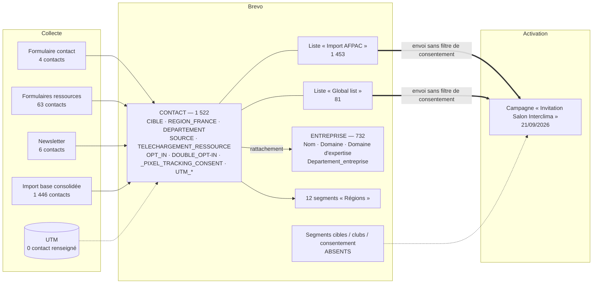
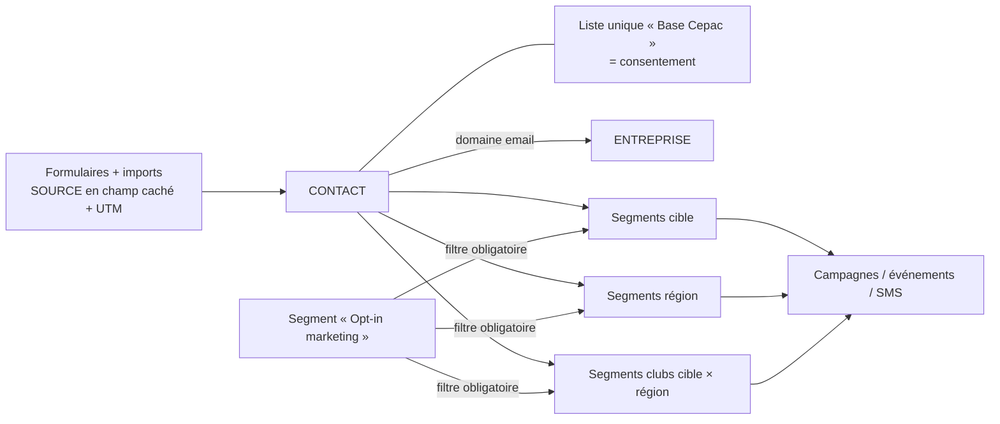

# Documentation CRM Brevo — CEPAC

| | |
|---|---|
| **Client** | CEPAC |
| **Rédaction** | Digitalised — William Borges (consultant CRM / chef de projet) |
| **Version** | v0.2 — 24/09/2026 |
| **Outil** | Brevo (ex-Sendinblue) |
| **Source des constats** | Extraction du compte Brevo en lecture seule, le 24/09/2026 (API Brevo v3, script `scripts/extract_brevo_config.py`) |

> **Méthode et limites**
> Les constats proviennent d'une extraction automatique **en lecture seule** : aucune donnée n'a été créée, modifiée ou envoyée. Seuls des volumes agrégés figurent ici, sans aucune donnée personnelle.
> L'API Brevo n'expose pas certains éléments : **conditions et volumes des segments, formulaires, workflows**. Ils restent marqués **« À relever dans l'interface »**.
> Lors de la première extraction, certains éléments n'ont pas pu être lus : **expéditeurs et domaines** (accès bloqué par le pare-feu Brevo) et **répartition des attributs de consentement** (`OPT_IN`, `DOUBLE_OPT-IN`, `_PIXEL_TRACKING_CONSENT`, `REGION_FRANCE`, car le script cherchait d'autres noms). Le script a été corrigé : une seconde extraction complétera ces points.

---

## 0. Synthèse

**État global** : le compte est opérationnel. Il compte **1 522 contacts**, **732 fiches Entreprise**, une première campagne envoyée, des attributs clés en valeurs figées et la fonction native de consentement au pixel activée. L'architecture diffère toutefois de la cible sur plusieurs points structurants (listes, segments, consentement dans le ciblage).

**🔴 Alertes RGPD, à traiter en priorité**

1. **La campagne « Invitation Salon Interclima » (envoyée le 21/09/2026) a ciblé la totalité des deux listes principales** (« Global list » et « Import AFPAC »), **sans segment et sans exclusion**. Or la base consolidée comprend environ **1 325 contacts sans opt-in explicite** (984 soft opt-ins ambigus et 341 sans opt-in). Sauf si ces contacts étaient déjà désinscrits ou blacklistés, **ils ont reçu cette invitation**. Il faut vérifier sans délai le nombre de destinataires réels et la répartition de `OPT_IN` et `DOUBLE_OPT-IN`, puis décider des mesures (voir §5.1).
2. **Aucun segment de consentement n'existe**, et aucun envoi ne filtre sur `OPT_IN` ou `DOUBLE_OPT-IN`. Tant que la liste d'envoi mélange opt-ins et non-opt-ins, chaque campagne reproduit le risque.
3. **84 contacts sont blacklistés**, alors que seuls 8 refus explicites étaient attendus. L'écart vient peut-être de désinscriptions ou de rebonds après la campagne Interclima : à analyser (§9).

**Points clés**

| | Constat |
|---|---|
| ✅ | `CIBLE` renseignée pour **1 168 contacts (77 %)**, avec 5 valeurs figées conformes |
| ✅ | `SOURCE` en Choix multiple, avec 4 options dont **« Newsletter » (ajoutée)** |
| ✅ | Consentement pixel géré par la **fonction native Brevo** (attributs `_PIXEL_TRACKING_CONSENT`, `_DATE`, `_SOURCE`). Bloc conditionnel, balise de révocation et lien de désinscription présents dans la campagne envoyée |
| ✅ | Objet Entreprise en place : **732 fiches**, attribut natif `Domaine`, typologie métier sur 25 valeurs |
| ⚠️ | **Pas de liste unique « Base Cepac »** : deux listes (« Import AFPAC » 1 453, « Global list » 81) |
| ⚠️ | **Aucun segment par cible, ni croisé, ni de consentement.** Seuls **12 segments régionaux sur 18** existent |
| ⚠️ | `DEPARTEMENT` est de type **nombre** : impossible de stocker « 2A », « 2B » ou « 01 ». Aucun contact n'est renseigné |
| ⚠️ | `TELECHARGEMENT_RESSOURCE` est en **texte libre** : 18 variantes de combinaisons pour 7 ressources réelles |
| ⚠️ | **Aucun contact n'a d'UTM renseigné**, alors qu'environ 73 contacts viennent des formulaires du site |
| ❌ | `SOUS_CIBLE` n'est pas paramétré (une seule valeur fictive). `ETABLISSEMENT`, `NIVEAU_FORMATION` et `CANAL_ORIGINE` n'existent pas |

---

## 1. Contexte et objectifs du CRM

La feuille de route communication 2026/2027 de CEPAC fixe un objectif : **« Transformer la communauté en capital relationnel »**, c'est-à-dire passer d'une logique de diffusion à une logique de relation directe et de mobilisation de l'écosystème.

**Cas d'usage attendus** : segmentation (fonction, entreprise, organisations professionnelles, collectivités, acteurs public-privé type offices HLM) ; newsletters générales ou segmentées et SMS ; invitations aux événements et follow-up ; animation de clubs par région et/ou par métier ; suivi one-to-one ; capture de la donnée de visite liée à la création de comptes ; parrainage et partenaires ; **conformité RGPD stricte**.

**Volumétrie** : KPI 2026 = 1 000 contacts qualifiés. Moins de 10 000 contacts à terme, et jusqu'à 100 000 si tout le réseau est touché. **Avec 1 168 contacts dont la `CIBLE` est renseignée, le KPI est atteint en volume.** Il reste à le consolider sur le consentement.

**Sources de contacts** : abonnés LinkedIn AFPAC, téléchargements (Memopac), webinaires, partenariats (France Rénov', bailleurs sociaux), cold mails, livres blancs, Google Ads et LinkedIn Ads.

**Pourquoi Brevo ?** CEPAC n'a ni activité B2C ni besoin de pilotage commercial (pipeline, tâches). Le besoin est un **embasement qualifié avec nurturing par cible**. Un outil de marketing automation y répond mieux qu'un CRM commercial type HubSpot : licences moins chères, paramétrage plus léger, meilleure adéquation.

**Intervenants** : CEPAC (Vincent Teillet), Digitalised (Julien Beltran, William Borges), Tribu (site web et formulaires).

**Compte Brevo** : abonnement actif avec un quota de **13 496 envois** sur la période du 20/09 au 20/10/2026. Le module Marketing Automation est activé.

---

## 2. Architecture

### 2.1 Principes cibles

| # | Principe | Statut constaté |
|---|---|---|
| 1 | Une seule liste globale **« Base Cepac »**, qui porte uniquement le consentement | ⚠️ Deux listes, « Import AFPAC » et « Global list », sans liste « Base Cepac » |
| 2 | Tout le ciblage passe par des **segments dynamiques** sur les attributs | ⚠️ Seulement 12 segments régionaux. La campagne envoyée cible des listes |
| 3 | **Valeurs figées** pour `CIBLE` et la région | ✅ Respecté (Choix multiple à valeurs figées, au lieu de Catégorie) |
| 4 | **`SOURCE`** en champ caché, alimenté automatiquement | ✅ Attribut conforme. Masquage sur les formulaires à relever |
| 5 | Deux objets **Contact** et **Entreprise**, localisation portée par le contact | ✅ Deux objets en place. ⚠️ Aucune localisation renseignée sur les contacts pour l'instant |
| 6 | **Choix multiple** pour les champs multi-valeurs | ⚠️ Oui pour `SOURCE`. Non pour `TELECHARGEMENT_RESSOURCE` (texte) |

### 2.2 Schéma de l'architecture constatée



### 2.3 Schéma cible



---

## 3. Dictionnaire des attributs

### 3.1 Objet Contact — attributs métier

| Attribut attendu | Attribut réel | Type réel | Valeurs configurées | Remplissage constaté | Statut |
|---|---|---|---|---|---|
| `EMAIL`, `PRENOM`, `NOM` | `EMAIL`, `PRENOM`, `NOM` | Standard / texte | — | — | ✅ |
| `POSTE` | `JOB_TITLE` (natif Brevo) | Texte | — | 0 renseigné (à confirmer lors de la seconde extraction) | ⚠️ Utiliser `JOB_TITLE` comme champ Poste |
| `CIBLE` | `CIBLE` | **Choix multiple** | Exploitant, Installateur, Prescripteur, Institution / Presse, En formation | 1 168 renseignés, 354 vides. Aucun contact n'a plusieurs cibles | ✅ Valeurs figées. Type différent de la cible (voir note) |
| `SOUS_CIBLE` | `SOUS_CIBLE` | Catégorie | **Une seule valeur fictive : « sous cible 1 »** | 0 | ❌ À paramétrer |
| `DEPARTEMENT` | `DEPARTEMENT` | **Nombre** | — | 0 | ❌ Type inadapté : à recréer en texte ou en catégorie |
| `REGION` | `REGION_FRANCE` | **Choix multiple** | 13 régions métropolitaines + 5 DROM (Guadeloupe, Guyane, La Réunion, Martinique, Mayotte) | Non mesuré (seconde extraction) | ✅ Valeurs figées, avec DROM inclus |
| `ETABLISSEMENT` | — | — | — | — | ❌ Absent |
| `NIVEAU_FORMATION` | — | — | — | — | ❌ Absent |
| `SOURCE` | `SOURCE` | Choix multiple | Formulaire Contact, Formulaire Ressource, Import AFPAC, **Newsletter** | 1 519 renseignés, 3 vides | ✅ |
| `TELECHARGEMENT_RESSOURCE` | `TELECHARGEMENT_RESSOURCE` | **Texte** | Valeurs séparées par des virgules | 1 391 renseignés, 131 vides | ⚠️ À convertir en Choix multiple |
| `CANAL_ORIGINE` | — | — | — | — | ❌ Absent (redondant avec `SOURCE` : à décider) |
| `CONSENT_MARKETING` | `OPT_IN` et `DOUBLE_OPT-IN` | Booléen / Catégorie (Yes, No) | — | Non mesuré (seconde extraction) | ⚠️ Deux attributs pour un même usage : clarifier leur rôle |
| `PIXEL_TRACKING_CONSENT` | `_PIXEL_TRACKING_CONSENT` (natif) | Booléen | — | Non mesuré | ✅ Fonction native Brevo |
| `PIXEL_TRACKING_CONSENT_DATE` | `_PIXEL_TRACKING_CONSENT_DATE` (natif) | Date | — | Non mesuré | ✅ |
| *(bonus)* | `_PIXEL_TRACKING_CONSENT_SOURCE` (natif) | Catégorie | form, api, import, revocation_link, manual | Non mesuré | ✅ Trace l'origine du consentement (preuve) |
| `UTM_SOURCE`, `UTM_MEDIUM`, `UTM_CAMPAIGN` | idem | Texte | — | **0 renseigné** | ⚠️ Tracking non opérationnel ou pas encore en ligne |

**Note sur le type Choix multiple de `CIBLE` et `REGION_FRANCE`** : les valeurs sont bien figées, ce qui répond à l'objectif principal. Ce type autorise toutefois un contact à avoir plusieurs cibles ou plusieurs régions, et les segments se construisent avec « contient ». Changer de type obligerait à recréer l'attribut et à réimporter les données. **Recommandation : conserver ce type**, avec une règle de gouvernance « une seule valeur par contact » (§12). Aujourd'hui, aucun contact n'a plusieurs cibles.

**Note sur `DEPARTEMENT`** : en type nombre, « 01 » devient « 1 », et la Corse (« 2A », « 2B ») ne peut pas être saisie. Comme aucun contact n'est renseigné, **le moment est idéal pour recréer l'attribut** en Catégorie (liste des départements) ou en texte à 2 ou 3 caractères.

### 3.2 Objet Contact — autres attributs présents

| Attribut | Type | Commentaire |
|---|---|---|
| `COMPANY_NAME` | Texte | Nom de l'entreprise saisi. Utile pour le rattachement à l'objet Entreprise |
| `MESSAGE` | Texte | Contenu libre du formulaire de contact. **Minimisation RGPD** : définir une durée de conservation, ou ne pas stocker ce champ dans le CRM |
| `TEST_FONCTIONNEL` | Booléen | Attribut de test : **à supprimer** une fois les tests terminés |
| `SMS`, `WHATSAPP`, `LANDLINE_NUMBER`, `LINKEDIN`, `EXT_ID`, `CONTACT_TIMEZONE` | Texte | Natifs Brevo |
| `BLACKLIST`, `READERS`, `CLICKERS` | Calculés | Natifs Brevo |
| `_LAST_EMAIL_OPEN_DATE`, `_DETECTED_LANGUAGE` | Natifs | Gérés par Brevo |

### 3.3 Objet Entreprise

**732 fiches Entreprise.**

| Attribut attendu | Attribut réel | Type | Commentaire | Statut |
|---|---|---|---|---|
| Nom | `name` (Nom de l'entreprise) | Texte | Natif | ✅ |
| `DOMAINE` | `domain` (Domaine) | Texte | Natif : clé de rapprochement | ✅ |
| `SECTEUR` | `domaine_d_expertise` | Liste à choix unique, **25 valeurs** | Administration, Apprenti, Association / Organisation professionnelle, Architecte, Assurance, Bailleurs, Bureau d'étude, Collectivité locale, Constructeur maisons individuelles, Diagnostiqueur, Économiste, Enseignant, Expertise, Énergéticien, Formateur, Industriel fabricant, Installateur, Ingénieur conseil, Lotisseur, Mainteneur, Maîtrise d'ouvrage, Organisme technique ou scientifique, Presse, Promoteur, Syndic copropriété | ✅ Plus riche que prévu |
| `REGION_SIEGE` | `departement_entreprise` | Texte | Localisation du siège (au département, pas à la région) | ⚠️ Texte libre : prévoir un format imposé |
| — | `website`, `linkedin`, `industry`, `number_of_employees`, `revenue`, `phone_number`, `owner` | Natifs | Propriétaire unique : une adresse générique CEPAC | — |

**Points d'attention**

- La valeur « Administration » de `domaine_d_expertise` a pour clé technique `test` : c'est un résidu de paramétrage, sans impact fonctionnel, à renommer si possible.
- Plusieurs valeurs de `domaine_d_expertise` décrivent des **personnes** plutôt que des entreprises (Apprenti, Enseignant, Formateur, Architecte). Elles recoupent la future `SOUS_CIBLE` du contact. **Recommandation** : s'appuyer sur ces 25 valeurs pour définir les valeurs de `SOUS_CIBLE` (par exemple, Prescripteur donne Architecte, Bureau d'étude, Économiste, Ingénieur conseil…), et garder côté Entreprise uniquement la typologie d'organisation.
- Règle de normalisation par domaine : la méthode ayant produit les 732 fiches reste à confirmer. Les **domaines génériques** (gmail.com, orange.fr, hotmail.fr, free.fr, wanadoo.fr, outlook.fr, laposte.net…) doivent être exclus. Un contrôle des fiches portant ces domaines est recommandé.

---

## 4. Listes et segments

### 4.1 Dossiers et listes

| Dossier | Liste | Contacts | Rôle constaté |
|---|---|---|---|
| Your first folder | **Import AFPAC** (id 8) | **1 453** | Base consolidée importée (≈ 1 455 contacts attendus) |
| Your first folder | **Global list** (id 2) | **81** | Contacts entrés hors import (formulaires, newsletter) : à confirmer |
| Contacts des conversations | Contacts impliqués dans les conversations (id 7) | 1 | Liste native Brevo (chat) |
| marketing_automation | identified_contacts (id 3) | 0 | Liste native Brevo (automation) |

Au moins 13 contacts appartiennent aux deux listes principales.

**Écart** : il n'y a pas de liste « Base Cepac ». Le nom « Import AFPAC » laisse penser qu'il s'agit de la base historique AFPAC. Or ses 1 453 contacts correspondent à la **base consolidée des 8 exports du site**. Il faut confirmer ce que contient réellement cette liste.

**Recommandation** : fusionner « Import AFPAC » et « Global list » dans une liste unique **« Base Cepac »**, la seule utilisée pour les envois, avec le ciblage par segments. Les dossiers et listes natifs Brevo restent en place. Il faut aussi renommer le dossier « Your first folder » en « CEPAC ».

### 4.2 Segments existants

12 segments, tous dans la catégorie **« Régions »** et créés le 10/09/2026 :

| Présents (12) | Absents (6) |
|---|---|
| Auvergne-Rhone-Alpes, Bourgogne-Franche-Compté, Bretagne, Centre-Val-de-loire, Corse, Grand-Est, Haut-de-France, Guadeloupe, Guyane, La Réunion, Martinique, Mayotte | **Île-de-France, Normandie, Nouvelle-Aquitaine, Occitanie, Pays de la Loire, Provence-Alpes-Côte d'Azur** |

- Les **conditions et volumes** des segments ne sont pas exposés par l'API : **à relever dans l'interface**. Il faut notamment vérifier que chaque segment filtre sur `REGION_FRANCE` avec la bonne valeur.
- Plusieurs noms de segments diffèrent des valeurs de l'attribut : « Haut-de-France » (au lieu de Hauts-de-France), « Bourgogne-Franche-Compté » (au lieu de Comté), « Centre-Val-de-loire », « Grand-Est », « Auvergne-Rhone-Alpes ». C'est sans impact si la condition est correcte, mais à harmoniser.
- Les 6 absents sont justement les régions les plus peuplées, à créer en priorité.

### 4.3 Segments à créer

| Famille | Condition | Cas d'usage | Priorité |
|---|---|---|---|
| **Consentement** | `OPT_IN = vrai` (et/ou `DOUBLE_OPT-IN = Yes`), non blacklisté | **Filtre obligatoire de tout envoi marketing** | 🔴 Haute |
| Cibles (×5) | `CIBLE contient Installateur` (etc.) | Newsletters ciblées | Haute |
| Régions manquantes (×6) | `REGION_FRANCE contient …` | Événements régionaux | Haute |
| Non qualifiés | `CIBLE est vide` (354 contacts) | Campagne de qualification | Moyenne |
| Clubs | `CIBLE contient X` ET `REGION_FRANCE contient Y` | Animation de clubs | Moyenne |
| Intérêt ressource | `TELECHARGEMENT_RESSOURCE contient …` | Nurturing post-téléchargement | Moyenne |
| Sous-cibles | `CIBLE` ET `SOUS_CIBLE` | Contenus métier | Après paramétrage de `SOUS_CIBLE` |

**Convention de nommage proposée** : `[Famille] Libellé`, par exemple `[Consent] Opt-in marketing`, `[Cible] Installateur`, `[Région] Occitanie`, `[Club] Installateur × Occitanie`. Les catégories de segments Brevo peuvent reprendre ces familles.

---

## 5. Consentement et conformité RGPD / CNIL

### 5.1 Opt-in marketing

**Référence (consolidation de la base)** : environ 125 opt-ins explicites, 984 soft opt-ins ambigus (Memopac), 341 sans opt-in, 8 refus explicites, 1 conflit.

**Constaté dans Brevo**

- Le consentement est porté par **deux attributs** : `OPT_IN` (booléen) et `DOUBLE_OPT-IN` (catégorie Yes/No). Il n'y a ni attribut `CONSENT_MARKETING`, ni liste de consentement dédiée.
- **Leur répartition n'a pas pu être mesurée** lors de la première extraction. Elle sera fournie par la seconde, croisée avec `SOURCE` et le statut blacklisté.
- **84 contacts sont blacklistés**, soit bien plus que les 8 refus explicites attendus.
- La campagne du 21/09/2026 a été envoyée aux listes entières, **sans filtre de consentement** (§7).

**Actions recommandées**

1. **Mesurer** la répartition de `OPT_IN` et `DOUBLE_OPT-IN` (seconde extraction) et le nombre réel de destinataires de la campagne Interclima (rapport de campagne dans l'interface).
2. **Documenter le rôle de chaque attribut**. Par exemple, `OPT_IN` = consentement marketing donné, `DOUBLE_OPT-IN` = consentement confirmé par email. Supprimer celui qui ferait doublon.
3. **Créer le segment `[Consent] Opt-in marketing`** et l'imposer comme filtre de toutes les campagnes marketing.
4. **Requalifier les soft opt-ins** par une campagne unique « Souhaitez-vous continuer à recevoir les informations CEPAC ? » avec double opt-in. Seuls les contacts qui confirment passent en opt-in. Point à valider juridiquement par CEPAC.
5. Vérifier que les **8 refus explicites** font partie des 84 blacklistés.

### 5.2 Pixel de tracking des ouvertures

- ✅ **La fonction native Brevo de consentement au pixel est active.** Les attributs système `_PIXEL_TRACKING_CONSENT`, `_PIXEL_TRACKING_CONSENT_DATE` et `_PIXEL_TRACKING_CONSENT_SOURCE` sont présents. Le dernier trace l'origine du consentement (formulaire, API, import, lien de révocation, manuel), ce qui constitue une bonne preuve RGPD.
- ✅ La campagne envoyée contient le **bloc conditionnel** sur le consentement pixel, la balise **`{{ revoke_open_pixel_tracking }}`** et un **lien de désinscription**.
- ⚠️ Le template « Invitation Salon » (inactif) contient la balise de révocation, mais **pas le bloc conditionnel**. Il faut l'ajouter pour que le template reste une base réutilisable conforme.
- À relever dans l'interface : la case pixel des formulaires, **décochée par défaut** et distincte du consentement newsletter.
- Le nombre de contacts ayant consenti au pixel n'a pas été mesuré (seconde extraction).

Bloc conditionnel de référence :

```

  <a href="{{ revoke_open_pixel_tracking }}">Ne plus suivre l'ouverture de mes emails</a>

```

*Le nom exact de l'attribut dans la condition doit être celui utilisé dans la campagne Interclima. Il faut le vérifier dans l'éditeur.*

### 5.3 Authentification de l'expéditeur

La liste des **expéditeurs et domaines authentifiés** (SPF, DKIM, DMARC) n'a pas pu être lue : l'accès a été bloqué par le pare-feu Brevo lors de la première extraction, et le script a été corrigé depuis. À défaut, contrôle possible dans l'interface : **Expéditeurs, domaines et IP dédiées**. L'authentification est exigée par Gmail et Yahoo depuis 2024.

---

## 6. Collecte : formulaires, champs cachés, tracking UTM

### 6.1 Provenance des contacts (`SOURCE`)

| Source | Contacts |
|---|---|
| Import AFPAC | 1 446 |
| Formulaire Ressource | 63 |
| Newsletter | 6 |
| Formulaire Contact | 4 |
| *(vide)* | 3 |

Aucun contact n'a plusieurs sources. Les 73 contacts issus des formulaires montrent que **la collecte depuis le site fonctionne**. La distinction ancien site / nouveau site envisagée n'a pas été mise en place.

### 6.2 Formulaires

- Formulaire de contact du site (Tribu) : suppression du champ « objet de la demande », ajout de la segmentation et de la localisation. Validé, mise en œuvre en cours.
- **Aucun contact n'a de `DEPARTEMENT` renseigné.** Le nouveau formulaire n'est donc pas encore en ligne, ou ne transmet pas ce champ. Avec le type nombre actuel, il ne pourrait de toute façon pas transmettre « 2A » ou « 2B ».
- Formulaires Brevo (champs, champs cachés, double opt-in) : **à relever dans l'interface**, car l'API ne les expose pas.

### 6.3 Tracking UTM

- ✅ Les attributs `UTM_SOURCE`, `UTM_MEDIUM` et `UTM_CAMPAIGN` existent, en type texte.
- ⚠️ **Aucun contact n'a d'UTM renseigné**, sur 73 contacts entrés par formulaire. Trois explications sont possibles : l'implémentation Tribu n'est pas encore en ligne, les champs cachés ne sont pas mappés vers Brevo, ou aucun visiteur n'est arrivé avec des UTM.
- **Test recommandé** : soumettre un formulaire depuis une URL de test `?utm_source=test&utm_medium=test&utm_campaign=test`, en naviguant sur une autre page avant la soumission pour tester la persistance, puis vérifier la fiche créée.

---

## 7. Templates et campagnes

### 7.1 Campagnes

| Campagne | Statut | Date d'envoi | Destinataires | Conformité du contenu |
|---|---|---|---|---|
| Invitation Salon Interclima | Envoyée | 21/09/2026 13:07 | Listes « Global list » + « Import AFPAC », **aucun segment, aucune exclusion** | ✅ Bloc pixel, balise de révocation, lien de désinscription |

- Les statistiques (délivrés, ouvertures, clics, désinscriptions) sont remontées à zéro lors de l'extraction : l'appel ne les incluait pas. Le script est corrigé. À défaut, consulter le rapport de campagne dans l'interface, en particulier **les désinscriptions et les plaintes**.
- Aucune campagne SMS.

### 7.2 Templates

| Template | Actif | Bloc pixel | Balise de révocation | Lien de désinscription |
|---|---|---|---|---|
| Invitation Salon | Non | ❌ | ✅ | ✅ |
| Templates Brevo par défaut (confirmation simple, confirmation double opt-in, suivi de désinscription, confirmation finale) | Oui | — | — | — *(emails transactionnels de confirmation : non concernés)* |

**Recommandation** : créer un **template maître CEPAC** (en-tête, pied de page, bloc pixel conditionnel, lien de désinscription, mentions légales), et en dériver toutes les campagnes.

---

## 8. Automatisations

- Le module Marketing Automation est **activé** sur le compte.
- Les workflows existants **ne sont pas exposés par l'API** : à relever dans l'interface (Automations), avec pour chacun le déclencheur, l'audience et le statut.

Automatisations recommandées à terme :

- **Bienvenue** : déclenchée à l'inscription, contenu selon la `CIBLE`.
- **Requalification** : contacts sans `CIBLE` (354) ou sans opt-in confirmé.
- **Suivi post-téléchargement** : basé sur `TELECHARGEMENT_RESSOURCE`.
- **Événement** : invitation, rappel, puis follow-up (à mettre en place pour les prochains salons).

---

## 9. État de la base (volumes agrégés au 24/09/2026)

### 9.1 Vue d'ensemble

| Indicateur | Valeur |
|---|---|
| Contacts | **1 522** |
| Contacts blacklistés (email) | **84** |
| Fiches Entreprise | **732** |
| Liste « Import AFPAC » | 1 453 |
| Liste « Global list » | 81 |
| Contacts avec UTM | 0 |
| Contacts avec département | 0 |

L'écart avec les ≈ 1 455 contacts de la consolidation correspond aux contacts entrés depuis par les formulaires.

### 9.2 Répartition par cible

| CIBLE | Contacts | Part |
|---|---|---|
| Prescripteur | 619 | 41 % |
| Institution / Presse | 170 | 11 % |
| Exploitant | 154 | 10 % |
| Installateur | 124 | 8 % |
| En formation | 101 | 7 % |
| *(non qualifié)* | 354 | 23 % |

Les 354 non qualifiés correspondent aux ≈ 350 contacts laissés volontairement sans cible lors de la consolidation.

### 9.3 Ressources téléchargées

Au moins une ressource a été téléchargée par **1 391 contacts**.

| Ressource | Contacts |
|---|---|
| Memopac - Intégration acoustique | 482 |
| Memopac - Dimensionnement PAC | 469 |
| Memopac - ancienne version | 394 |
| Memopac - Raccordement électrique | 307 |
| Dimensionnement des PAC collectives en résidentiel collectif | 33 |
| Raccordement électrique des PAC collectives en résidentiel collectif | 21 |
| Intégration acoustique des PAC centralisées en résidentiel collectif | 14 |

*Totaux recalculés à partir des 18 combinaisons stockées en texte. Un contact peut avoir téléchargé plusieurs ressources.*

### 9.4 Non mesuré à ce stade

Il reste à mesurer, lors de la seconde extraction : la répartition par région, par statut `OPT_IN` et `DOUBLE_OPT-IN`, et par consentement pixel ; le croisement cible × région (taille des futurs clubs) ; le croisement consentement × source × blacklist.

---

## 10. Écarts entre architecture cible et configuration réelle

| # | Élément | Attendu | Constaté | Action recommandée | Priorité |
|---|---|---|---|---|---|
| 1 | Ciblage des campagnes | Segment avec filtre opt-in | Listes entières, sans filtre | Créer `[Consent] Opt-in marketing` et l'imposer à chaque envoi | 🔴 |
| 2 | Consentement | Un attribut clair + statut de liste | `OPT_IN` + `DOUBLE_OPT-IN`, répartition inconnue | Mesurer, documenter le rôle de chacun, supprimer le doublon | 🔴 |
| 3 | Soft opt-ins (≈ 984) | Pas d'envoi avant requalification | Non isolés | Campagne de requalification avec double opt-in | 🔴 |
| 4 | Blacklist | 8 refus | 84 blacklistés | Analyser l'origine (refus, désinscriptions Interclima, rebonds) | Haute |
| 5 | Liste unique | « Base Cepac » | « Import AFPAC » + « Global list » | Fusionner dans « Base Cepac » | Haute |
| 6 | Segments cibles | 5 segments | Absents | Créer | Haute |
| 7 | Segments régionaux | 18 | 12 | Créer les 6 manquants, harmoniser les noms | Haute |
| 8 | `DEPARTEMENT` | Texte ou catégorie (01, 2A…) | Nombre, vide | Recréer en Catégorie ou en texte | Haute |
| 9 | UTM | Renseignés par les formulaires | 0 renseigné | Tester avec Tribu | Haute |
| 10 | `TELECHARGEMENT_RESSOURCE` | Choix multiple | Texte, 18 variantes | Créer un attribut Choix multiple (7 options), migrer, supprimer l'ancien | Moyenne |
| 11 | `SOUS_CIBLE` | Catégorie paramétrée | Une valeur fictive | Définir les valeurs par cible (s'inspirer de `domaine_d_expertise`) | Moyenne |
| 12 | `CIBLE`, `REGION_FRANCE` | Catégorie | Choix multiple à valeurs figées | Conserver, avec la règle « une seule valeur » | Faible |
| 13 | `ETABLISSEMENT`, `NIVEAU_FORMATION` | Présents | Absents | Créer si le formulaire « En formation » les collecte | Moyenne |
| 14 | `CANAL_ORIGINE` | Présent | Absent | Décider s'il est utile en plus de `SOURCE` et UTM | Faible |
| 15 | `POSTE` | Texte | `JOB_TITLE` natif | Utiliser `JOB_TITLE` (mettre à jour le mapping du formulaire) | Faible |
| 16 | Template « Invitation Salon » | Bloc pixel conditionnel | Absent | Ajouter, ou le remplacer par un template maître | Moyenne |
| 17 | `TEST_FONCTIONNEL` | — | Attribut de test | Supprimer | Faible |
| 18 | `MESSAGE` | — | Texte libre stocké | Définir une durée de conservation (minimisation) | Moyenne |
| 19 | Entreprises | Une fiche par domaine, domaines génériques exclus | 732 fiches, méthode inconnue | Contrôler les fiches sur domaines génériques | Moyenne |
| 20 | Domaine d'envoi | SPF / DKIM / DMARC | Non lu | Vérifier dans l'interface ou via la seconde extraction | Haute |

---

## 11. Points ouverts et prochaines étapes

**Points ouverts (mis à jour)**

| Point ouvert (brief) | Réponse |
|---|---|
| `TELECHARGEMENT_RESSOURCE` au même format que `SOURCE` ? | **Non** : type texte, à convertir |
| Option « Newsletter » dans `SOURCE` ? | **Oui**, ajoutée (6 contacts) |
| Normalisation Entreprise par domaine | 732 fiches créées ; règle et exclusions à confirmer |
| Import base historique AFPAC | Liste « Import AFPAC » de 1 453 contacts ≈ base consolidée : **confirmer si la base historique AFPAC (abonnés LinkedIn…) reste à importer** |
| `SOUS_CIBLE`, `ETABLISSEMENT`, `NIVEAU_FORMATION`, `DEPARTEMENT`, `REGION` créés ? | `REGION_FRANCE` ✅ ; `DEPARTEMENT` créé mais mal typé ; `SOUS_CIBLE` vide de sens ; `ETABLISSEMENT` et `NIVEAU_FORMATION` absents |

**Prochaines étapes**

| # | Action | Responsable | Échéance suggérée |
|---|---|---|---|
| 1 | Analyser les destinataires et désinscriptions de la campagne Interclima | Digitalised | Immédiat |
| 2 | Lancer la seconde extraction (consentement, régions, expéditeurs, statistiques) | Digitalised | Immédiat |
| 3 | Créer le segment `[Consent] Opt-in marketing` et l'appliquer à tout envoi | Digitalised | Avant le prochain envoi |
| 4 | Valider la stratégie de requalification des soft opt-ins | CEPAC | Sous 2 semaines |
| 5 | Recréer `DEPARTEMENT`, convertir `TELECHARGEMENT_RESSOURCE`, paramétrer `SOUS_CIBLE` | Digitalised | Avant la mise en ligne du formulaire |
| 6 | Mettre en ligne le formulaire, tester les UTM et champs cachés | Tribu | Selon planning Tribu |
| 7 | Fusionner les listes dans « Base Cepac », créer les segments cibles et régions | Digitalised | Sous 2 semaines |
| 8 | Relever dans l'interface les conditions et volumes des segments, les formulaires et les workflows | Digitalised | Sous 1 semaine |

**Relancer l'extraction** (lecture seule, résultats agrégés sans données personnelles) :

```bash
cd ~/Downloads   # dossier contenant le script
export BREVO_API_KEY="..."            # clé API, à révoquer après usage
export SSL_CERT_FILE=$(python3 -m certifi)
python3 extract_brevo_config.py > brevo_snapshot.json
```

---

## 12. Règles de gouvernance

Ces règles permettent de faire évoluer la base sans casser la structure.

**Envoyer une campagne marketing**
1. Toujours cibler un **segment**, jamais une liste brute.
2. Le segment doit **inclure le filtre `[Consent] Opt-in marketing`**.
3. Partir du template maître : bloc pixel conditionnel et lien de désinscription obligatoires.
4. Faire valider l'audience (volume, filtre de consentement) par un second intervenant avant l'envoi.

**Ajouter une cible ou une sous-cible**
1. Ajouter la valeur dans l'attribut (`CIBLE` ou `SOUS_CIBLE`). Jamais de texte libre.
2. Mettre à jour **en même temps** la liste déroulante du formulaire Tribu.
3. Créer le segment `[Cible] <valeur>`.
4. Mettre à jour ce document (§3 et §4).

**Une seule valeur par contact** pour `CIBLE` et `REGION_FRANCE`. Le type Choix multiple en autorise plusieurs, mais les formulaires et imports ne doivent en envoyer qu'une.

**Ajouter une source de contacts**
1. Ajouter l'option à `SOURCE`.
2. Configurer la valeur en **champ caché** sur le formulaire concerné.
3. Documenter le **fondement du consentement** de cette source avant tout envoi.

**Créer un segment**
- Le construire uniquement sur des attributs. Pas de nouvelle liste pour cibler.
- Respecter la convention `[Famille] Libellé` et la bonne catégorie de segment.
- Recopier les libellés exacts des valeurs d'attribut (par exemple « Hauts-de-France »).

**Importer des contacts**
- Toujours dans la liste unique, avec `SOURCE` et le statut de consentement (`OPT_IN`) renseignés.
- Format Choix multiple : `['Option1'|'Option2']`.
- Dédoublonner, retirer les emails invalides, normaliser sur les valeurs figées **avant** l'import.
- Ne jamais importer en opt-in un contact dont le consentement n'est pas prouvé.

**Attributs**
- Pas de création d'attribut sans mise à jour de ce dictionnaire.
- Les attributs de test (`TEST_*`) sont supprimés dès la fin des tests.
- Les attributs système Brevo (préfixe `_`) ne sont jamais modifiés manuellement.

**Données personnelles et accès**
- Les rapports et documentations ne contiennent que des volumes agrégés.
- Les clés API sont nominatives, créées pour un usage précis et **révoquées après usage**. Elles ne sont jamais partagées par email ou messagerie.
- Toute demande d'exercice de droits (accès, suppression) est traitée dans Brevo et tracée.
