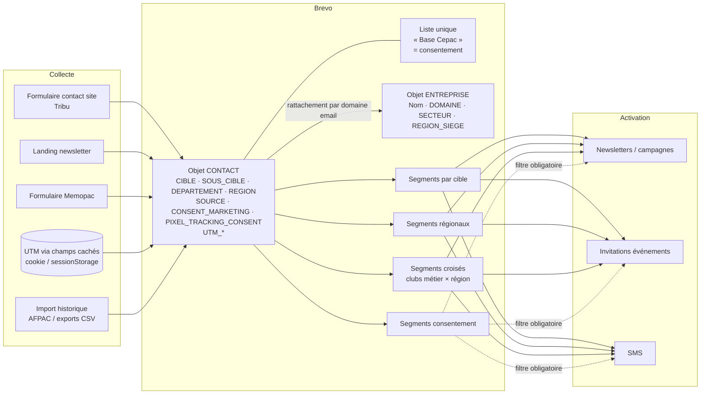

# Documentation CRM Brevo — CEPAC

| | |
|---|---|
| **Client** | CEPAC |
| **Rédaction** | Digitalised — William Borges (consultant CRM / chef de projet) |
| **Version** | v0.1 — 24/09/2026 — *version de travail* |
| **Outil** | Brevo (ex-Sendinblue) |

> **⚠️ Avertissement sur cette version**
> Cette version décrit l'**architecture cible** et l'état du projet tel que documenté par Digitalised. La lecture automatique du compte Brevo n'a **pas pu avoir lieu** : le connecteur MCP Brevo n'était pas connecté à la session de rédaction, et aucune clé API n'était disponible.
> Tous les éléments marqués **« Non vérifié »** doivent être confirmés dans le compte. Pour cela, soit on reconnecte le MCP Brevo, soit on lance le script en lecture seule `scripts/extract_brevo_config.py` (voir §11). Aucune donnée n'a été supposée ni inventée.

---

## 0. Synthèse

**État global** : l'architecture est définie (une liste de consentement, un ciblage par segments dynamiques, deux objets Contact et Entreprise). Plusieurs chantiers sont encore en cours : import AFPAC, formulaires Tribu, UTM, normalisation des entreprises.

Points clés :

1. **Une seule liste, « Base Cepac »**, qui porte uniquement le consentement. Tout le ciblage passe par des **segments dynamiques** construits sur les attributs.
2. **`CIBLE` et `REGION` doivent être des attributs de type Catégorie** (valeurs figées). Le texte libre casse les segments.
3. **`SOURCE`** est un champ caché, en Choix multiple, alimenté automatiquement. L'option **« Newsletter »** doit encore être ajoutée.
4. **La localisation est portée par le Contact**, pas par l'Entreprise.
5. **Base consolidée** : environ 1 455 contacts uniques issus de 8 exports du site, dont environ 350 volontairement sans `CIBLE`.
6. **UTM** : les attributs `UTM_SOURCE`, `UTM_MEDIUM` et `UTM_CAMPAIGN` sont créés. L'alimentation dépend de l'implémentation Tribu.
7. **Pixel de tracking** : un consentement dédié est défini (case décochée par défaut, conforme aux recommandations CNIL).

**🔴 Alertes RGPD, à traiter en priorité**

- **Environ 1 325 contacts n'ont pas d'opt-in explicite** : 984 soft opt-ins ambigus (Memopac), 341 sans opt-in. À cela s'ajoutent 8 refus et 1 conflit. Ces contacts **ne doivent recevoir aucune communication marketing** tant qu'ils ne sont pas requalifiés. Il faut vérifier dans Brevo que ce blocage est effectif : statut d'abonnement dans Base Cepac et/ou valeur de `CONSENT_MARKETING`, **et** exclusion systématique dans les segments d'envoi. *Non vérifié.*
- Les **8 refus explicites** doivent figurer comme **désinscrits ou blacklistés**, et pas simplement comme « sans opt-in ». *Non vérifié.*
- EDF étant présent dans l'écosystème, le niveau d'exigence est maximal : aucune campagne ne doit partir sur la liste entière sans filtre de consentement.

---

## 1. Contexte et objectifs du CRM

La feuille de route communication 2026/2027 de CEPAC fixe un objectif : **« Transformer la communauté en capital relationnel »**, c'est-à-dire passer d'une logique de diffusion à une logique de relation directe et de mobilisation de l'écosystème.

**Cas d'usage attendus**

- Segmentation par fonction, entreprise, organisation professionnelle, collectivité, acteur public-privé (offices HLM…)
- Opérations push : newsletters générales ou segmentées, SMS
- Invitations aux événements et follow-up
- Animation de clubs par région et/ou par métier
- Suivi des relations one-to-one
- Capture de la donnée de visite du site, liée à la création de comptes
- Parrainage et opérations partenaires
- Conformité RGPD stricte

**Volumétrie** : KPI 2026 = 1 000 contacts qualifiés. Moins de 10 000 contacts à terme, et jusqu'à 100 000 si tout le réseau est touché.

**Sources de contacts** : abonnés LinkedIn AFPAC, téléchargements (Memopac), webinaires, partenariats (France Rénov', bailleurs sociaux), cold mails, livres blancs, Google Ads et LinkedIn Ads.

**Pourquoi Brevo ?** CEPAC ne fait pas de B2C et n'a pas besoin de pilotage commercial (pipeline, tâches). Le besoin est un **embasement qualifié avec nurturing par cible**. Un outil de marketing automation comme Brevo y répond mieux qu'un CRM commercial type HubSpot, qui coûte plus cher en licences et demande un paramétrage plus lourd.

**Intervenants** : CEPAC (Vincent Teillet), Digitalised (Julien Beltran, William Borges), Tribu (site web et formulaires).

---

## 2. Architecture

### Principes

| # | Principe | Pourquoi |
|---|---|---|
| 1 | **Une seule liste globale : « Base Cepac »** | Elle porte uniquement le statut d'inscription et de désinscription. Les listes ne servent pas à cibler. |
| 2 | **Ciblage par segments dynamiques** | Les segments se recalculent automatiquement quand un attribut change (changement de poste, de région, étudiant devenu installateur…). Une liste, elle, est statique. |
| 3 | **Valeurs figées** pour `CIBLE` et `REGION` | On évite ainsi les variantes (« IDF », « Île-de-France »…) qui cassent les segments. |
| 4 | **`SOURCE` en champ caché** | Il trace la provenance, utile pour gérer l'opt-in et les campagnes de réengagement. Il n'apparaît jamais sur un formulaire public. |
| 5 | **Deux objets : Contact et Entreprise** | La localisation est portée par le **contact** : c'est la localisation de la personne qui détermine son groupe régional. |
| 6 | **Choix multiple plutôt que tags** | Pour les champs multi-valeurs (ressources téléchargées, sources). |

### Schéma



---

## 3. Dictionnaire des attributs

### 3.1 Objet Contact

| Attribut | Type attendu | Valeurs / règle | Usage | Remplissage | Constaté dans Brevo |
|---|---|---|---|---|---|
| `EMAIL`, `PRENOM`, `NOM` | Standard | Natifs | Identification | Formulaire / import | Non vérifié |
| `POSTE` | Texte | Vide pour la cible En formation | Personnalisation, qualification | Formulaire / import | Non vérifié |
| `CIBLE` | **Catégorie** | `Prescripteur`, `Installateur`, `Exploitant`, `En formation`, `Institution / Presse`. Vide = non qualifié | Segmentation principale | Formulaire (liste déroulante) / import | Non vérifié |
| `SOUS_CIBLE` | Catégorie (recommandé) | Dépend de la cible (ex. Architectes pour Prescripteur) | Segmentation fine | Formulaire / qualification | Non vérifié : **création à confirmer** |
| `DEPARTEMENT` | Catégorie ou texte (code à 2 chiffres) | 01 à 95, 2A/2B, DOM | Donnée géographique la plus fiable | Formulaire | Non vérifié : création à confirmer |
| `REGION` | **Catégorie** | 13 régions métropolitaines (valeurs figées) | Clubs régionaux | Dérivée du département | Non vérifié : création à confirmer |
| `ETABLISSEMENT` | Texte | Uniquement si CIBLE = En formation | Relation écoles | Formulaire conditionnel | Non vérifié : création à confirmer |
| `NIVEAU_FORMATION` | Catégorie | BTS, Licence pro, Master, Alternance… | Segmentation étudiants | Formulaire conditionnel | Non vérifié : création à confirmer |
| `SOURCE` | **Choix multiple** | Envisagé : Formulaire site (ancien / nouveau site), Import Afpac, **Newsletter (à ajouter)** | Provenance, gestion de l'opt-in, réengagement | **Champ caché**, automatique | Non vérifié : relever les options réelles |
| `TELECHARGEMENT_RESSOURCE` | Choix multiple | Ressources téléchargées (Memopac…) | Nurturing par intérêt | Formulaire de téléchargement | Non vérifié : **type réel à confirmer** |
| `CANAL_ORIGINE` | Catégorie (recommandé) | Formulaire contact, landing newsletter, formulaire Memopac… | Analyse d'acquisition | Automatique | Non vérifié |
| `CONSENT_MARKETING` | Booléen ou catégorie | Yes / No à l'import | Opt-in marketing | Formulaire / import | Non vérifié |
| `PIXEL_TRACKING_CONSENT` | Booléen | Case décochée par défaut | Consentement au suivi des ouvertures | Formulaire | Non vérifié |
| `PIXEL_TRACKING_CONSENT_DATE` | Date | Horodatage | Preuve RGPD | Automatique | Non vérifié |
| `UTM_SOURCE`, `UTM_MEDIUM`, `UTM_CAMPAIGN` | Texte | Valeurs issues de l'URL | Attribution des campagnes | Champs cachés (Tribu) | Créés d'après le projet. Remplissage non vérifié |

*La date d'inscription ne nécessite pas d'attribut dédié : Brevo trace nativement la date de création du contact.*

**Liste de référence des 13 valeurs de `REGION`** : Auvergne-Rhône-Alpes, Bourgogne-Franche-Comté, Bretagne, Centre-Val de Loire, Corse, Grand Est, Hauts-de-France, Île-de-France, Normandie, Nouvelle-Aquitaine, Occitanie, Pays de la Loire, Provence-Alpes-Côte d'Azur. *(Il reste à décider s'il faut prévoir une valeur « Outre-mer » ou « Hors France ».)*

### 3.2 Objet Entreprise

| Attribut | Type attendu | Remarque | Constaté |
|---|---|---|---|
| Nom | Standard | Natif | Non vérifié |
| `DOMAINE` | Texte | Domaine extrait de l'email : clé de rapprochement et de dédoublonnage | Non vérifié |
| `REGION_SIEGE` | Catégorie | Optionnel (mêmes valeurs que `REGION`) | Non vérifié |
| `SECTEUR` | Catégorie | Optionnel | Non vérifié |

**Règle de normalisation (encore à valider)** : une fiche Entreprise par domaine, et chaque contact rattaché par correspondance avec le domaine de son email. Les **domaines génériques** (gmail.com, orange.fr, hotmail.fr, free.fr, wanadoo.fr, outlook.fr, laposte.net…) **doivent être exclus** du rattachement. Sinon, une fausse « entreprise » regrouperait des centaines de particuliers.

Nombre de fiches Entreprise : *non vérifié.*

---

## 4. Listes et segments

### 4.1 Listes

| Liste | Rôle | Volume | Abonnés / désabonnés |
|---|---|---|---|
| Base Cepac | Porte le consentement. Liste d'envoi « toutes cibles » | Non vérifié | Non vérifié |

Toute autre liste présente dans le compte (listes d'import temporaires, listes de test) doit être signalée, puis archivée ou supprimée après validation.

### 4.2 Segments attendus

| Famille | Condition type | Cas d'usage | Présent / volume |
|---|---|---|---|
| Par cible (×5) | `CIBLE = Installateur` (etc.) | Newsletters ciblées | Non vérifié |
| Par sous-cible | `CIBLE = Prescripteur` ET `SOUS_CIBLE = Architectes` | Contenus métier | Non vérifié |
| Régionaux (×13) | `REGION = Auvergne-Rhône-Alpes` | Événements régionaux | Non vérifié |
| Croisés (clubs) | `CIBLE = Installateur` ET `REGION = …` | Animation de clubs | Non vérifié |
| Toutes cibles qualifiées | `CIBLE est renseigné` | Envoi global aux contacts qualifiés | Non vérifié |
| Non qualifiés | `CIBLE est vide` | Campagnes de qualification | Non vérifié |
| **Opt-in marketing** | Abonné à Base Cepac ET `CONSENT_MARKETING = Yes` | **Filtre obligatoire pour tout envoi marketing** | Non vérifié |
| Pixel consenti | `PIXEL_TRACKING_CONSENT = true` | Suivi des ouvertures, personnalisation | Non vérifié |

**Recommandation** : chaque segment d'envoi marketing doit **inclure la condition d'opt-in**. Par exemple, « Installateurs AURA » = `CIBLE = Installateur` ET `REGION = Auvergne-Rhône-Alpes` ET opt-in. On évite ainsi qu'un segment de ciblage soit utilisé par erreur sur des contacts sans consentement.

**Convention de nommage proposée** : `[Famille] Libellé`, par exemple `[Cible] Installateur`, `[Région] Occitanie`, `[Club] Installateur × Occitanie`, `[Consent] Opt-in marketing`.

---

## 5. Consentement et conformité RGPD / CNIL

### 5.1 Opt-in marketing

- Le consentement est porté par le **statut natif de la liste Base Cepac** et par l'attribut `CONSENT_MARKETING`.
- Répartition reconstituée ligne à ligne depuis les 8 fichiers sources lors de la consolidation :

| Statut de consentement | Volume (consolidation) | Traitement attendu dans Brevo | Constaté |
|---|---|---|---|
| Opt-in explicite | ≈ 125 | Abonné, `CONSENT_MARKETING = Yes` | Non vérifié |
| Soft opt-in ambigu (Memopac) | ≈ 984 | **Pas d'envoi marketing** avant requalification | Non vérifié |
| Sans opt-in | ≈ 341 | **Pas d'envoi marketing** | Non vérifié |
| Refus explicite | 8 | **Désinscrit / blacklisté** | Non vérifié |
| Conflit | 1 | Revue manuelle | Non vérifié |

**Recommandation pour les ~984 soft opt-ins** : une **campagne unique de requalification** (« Souhaitez-vous continuer à recevoir les informations CEPAC ? ») avec double opt-in. Seuls les contacts qui confirment passent à `CONSENT_MARKETING = Yes`. Ce point est à valider juridiquement par CEPAC.

### 5.2 Pixel de tracking des ouvertures

- Une case dédiée, **décochée par défaut** et distincte du consentement newsletter : *« J'accepte que Cepac suive l'ouverture de mes emails à des fins de personnalisation »*.
- Enregistrement dans `PIXEL_TRACKING_CONSENT` et `PIXEL_TRACKING_CONSENT_DATE` (preuve).
- Révocation via la balise native `{{ revoke_open_pixel_tracking }}`.
- Dans les templates, un bloc conditionnel affiche le lien de retrait **uniquement si** le contact a consenti :

```

  <a href="{{ revoke_open_pixel_tracking }}">Ne plus suivre l'ouverture de mes emails</a>

```

- Le **lien de désinscription standard** reste géré nativement par Brevo, **en dehors** du bloc conditionnel.

**À vérifier dans le compte** : le paramètre de suivi des ouvertures et le mode de consentement au tracking ; la présence du bloc conditionnel et de la balise dans chaque template ; la présence du lien de désinscription. *Non vérifié.*

### 5.3 Authentification de l'expéditeur

L'authentification SPF, DKIM et DMARC du domaine d'envoi est à vérifier. Elle conditionne la délivrabilité et est exigée par Gmail et Yahoo depuis 2024. *Non vérifié.*

---

## 6. Collecte : formulaires, champs cachés, tracking UTM

### 6.1 Formulaire de contact du site (Tribu)

- Modification validée : suppression du champ « objet de la demande », ajout de la segmentation (`CIBLE`, et `SOUS_CIBLE` si retenu) et de la localisation (`DEPARTEMENT`). Mise en œuvre en cours côté Tribu.
- Champs cachés attendus : `SOURCE`, `CANAL_ORIGINE`, `UTM_SOURCE`, `UTM_MEDIUM`, `UTM_CAMPAIGN`.
- Cases de consentement : newsletter (opt-in marketing) et pixel, distinctes et décochées par défaut.

### 6.2 Formulaires Brevo

Les champs, champs cachés et le paramétrage du double opt-in des formulaires Brevo sont à relever. *Non vérifié* (l'API Brevo n'expose pas les formulaires : relevé manuel dans l'interface).

### 6.3 Tracking UTM

Brief technique livré à Tribu :

1. Au chargement de la page, lecture des paramètres UTM de l'URL.
2. Persistance dans un cookie ou le sessionStorage, pour conserver l'UTM si l'internaute navigue avant de remplir le formulaire.
3. Pré-remplissage en JavaScript des champs cachés du formulaire.
4. Synchronisation vers les attributs Brevo `UTM_SOURCE`, `UTM_MEDIUM`, `UTM_CAMPAIGN` (type texte).

**Test de bon fonctionnement** : si des contacts créés après la mise en ligne ont des UTM renseignés, l'implémentation fonctionne. *Non vérifié.*

---

## 7. Templates et campagnes

| Élément | À relever | Constaté |
|---|---|---|
| Templates email | Nom, statut, bloc conditionnel pixel, balise `revoke_open_pixel_tracking`, lien de désinscription | Non vérifié |
| Campagnes email | Nom, statut (brouillon / programmée / envoyée), date, liste ou segment visé, statistiques agrégées | Non vérifié |
| Campagnes SMS | Nom, statut | Non vérifié |

**Règle** : chaque campagne marketing vise un **segment qui inclut le filtre d'opt-in**, jamais la liste Base Cepac brute tant que des contacts sans consentement y figurent.

---

## 8. Automatisations

Les workflows existants restent à relever (déclencheur, audience, statut actif ou inactif). *Non vérifié.* L'API Brevo ne liste pas les workflows : le relevé se fait dans l'interface (Automations).

Automatisations recommandées à terme :

- **Bienvenue** : déclenchée à l'inscription, contenu adapté à la `CIBLE`.
- **Requalification** : à destination des contacts sans `CIBLE` ou en soft opt-in.
- **Suivi post-téléchargement** Memopac, basé sur `TELECHARGEMENT_RESSOURCE`.
- **Relance événement** : invitation, rappel, puis follow-up.

---

## 9. État de la base (volumes agrégés)

| Indicateur | Référence projet | Constaté dans Brevo |
|---|---|---|
| Contacts dans Base Cepac | ≈ 1 455 après consolidation | Non vérifié : import à confirmer |
| Contacts sans `CIBLE` | ≈ 350 (volontaire) | Non vérifié |
| Répartition par `CIBLE` | — | Non vérifié |
| Répartition par `SOURCE` | — | Non vérifié |
| Répartition par statut de consentement | cf. §5.1 | Non vérifié |
| Contacts avec UTM renseignés | — | Non vérifié |
| Fiches Entreprise | — | Non vérifié |
| Base historique AFPAC | Import avec qualification opt-in en cours | Non vérifié |

Rappels sur la consolidation : 8 exports CSV (ancien et nouveau site), dédoublonnage, suppression des entrées de test et de 4 emails invalides, noms en Title Case. Le format d'import Choix multiple utilisé est `['Option1'|'Option2']`.

---

## 10. Écarts entre architecture cible et configuration réelle

> Ce tableau recense les **points de contrôle**. La colonne « Constaté » sera complétée à partir de la lecture du compte.

| Élément | Attendu | Constaté | Action recommandée |
|---|---|---|---|
| Liste Base Cepac | Liste unique de consentement | Non vérifié | Vérifier qu'aucune autre liste ne sert au ciblage |
| `CIBLE` | Catégorie, 5 valeurs figées | Non vérifié | Convertir en Catégorie si c'est du texte |
| `SOUS_CIBLE` | Catégorie | Non vérifié | Créer si absent, en définissant les valeurs par cible |
| `DEPARTEMENT` | Catégorie ou texte à 2 caractères | Non vérifié | Créer si absent |
| `REGION` | Catégorie, 13 valeurs | Non vérifié | Créer si absent, et prévoir la dérivation depuis le département |
| `ETABLISSEMENT`, `NIVEAU_FORMATION` | Texte / Catégorie | Non vérifié | Créer si absents |
| `SOURCE` | Choix multiple avec option « Newsletter » | Non vérifié | **Ajouter l'option « Newsletter »** |
| `TELECHARGEMENT_RESSOURCE` | Choix multiple | Non vérifié | Aligner sur le type de `SOURCE` |
| `CONSENT_MARKETING` | Cohérent avec le statut de la liste | Non vérifié | Contrôler les ~1 325 contacts sans opt-in explicite |
| Refus explicites (8) | Désinscrits / blacklistés | Non vérifié | Blacklister si ce n'est pas fait |
| `PIXEL_TRACKING_CONSENT(_DATE)` | Booléen + Date | Non vérifié | Créer si absents |
| UTM | 3 attributs alimentés | Créés, alimentation non vérifiée | Tester un formulaire avec une URL UTM |
| Objet Entreprise | Fiche par domaine, attribut `DOMAINE` | Non vérifié | Valider la règle, exclure les domaines génériques |
| Segments | Familles §4.2 avec filtre opt-in | Non vérifié | Créer ou compléter selon la convention de nommage |
| Templates | Bloc pixel + désinscription | Non vérifié | Mettre en conformité |
| Domaine d'envoi | SPF / DKIM / DMARC | Non vérifié | Authentifier si ce n'est pas fait |

---

## 11. Points ouverts et prochaines étapes

**Points ouverts**

1. `TELECHARGEMENT_RESSOURCE` : même format Choix multiple que `SOURCE` ?
2. L'option « Newsletter » a-t-elle été ajoutée à `SOURCE` ?
3. Normalisation des entreprises par nom de domaine : à valider (règle et liste d'exclusion).
4. Import de la base historique AFPAC : statut à confirmer.
5. `SOUS_CIBLE`, `ETABLISSEMENT`, `NIVEAU_FORMATION`, `DEPARTEMENT`, `REGION` : sont-ils créés, et avec des valeurs figées ?
6. Traitement des ~984 soft opt-ins : campagne de requalification à valider par CEPAC.
7. Formulaire Tribu : date de mise en ligne, et test des champs cachés et des UTM.

**Prochaines étapes**

| # | Action | Responsable |
|---|---|---|
| 1 | Lire le compte (MCP Brevo ou script `scripts/extract_brevo_config.py`) et compléter les colonnes « Constaté » | Digitalised |
| 2 | Corriger les écarts du §10 après validation | Digitalised |
| 3 | Valider la stratégie de requalification des soft opt-ins | CEPAC |
| 4 | Mettre en ligne le formulaire et tester UTM et champs cachés | Tribu |
| 5 | Finaliser l'import AFPAC avec qualification opt-in | Digitalised |
| 6 | Valider la normalisation Entreprise par domaine | Digitalised + CEPAC |

**Utiliser le script d'extraction** (lecture seule, requêtes GET uniquement, sortie en volumes agrégés sans données personnelles) :

```bash
export BREVO_API_KEY=xkeysib-...   # clé en lecture, à ne jamais committer
python3 scripts/extract_brevo_config.py > brevo_snapshot.json
```

Limites de l'API : les formulaires, les workflows et les conditions exactes des segments ne sont pas exposés. Ils se relèvent dans l'interface.

---

## 12. Règles de gouvernance

Ces règles permettent de faire évoluer la base sans casser la structure.

**Ajouter une cible ou une sous-cible**
1. Ajouter la valeur dans l'attribut Catégorie (`CIBLE` ou `SOUS_CIBLE`). Ne jamais saisir de texte libre.
2. Mettre à jour la liste déroulante du formulaire Tribu **en même temps**.
3. Créer le segment `[Cible] <valeur>`, avec sa variante opt-in.
4. Mettre à jour ce document (§3 et §4).

**Ajouter une source de contacts**
1. Ajouter l'option à `SOURCE` (Choix multiple) et, si besoin, à `CANAL_ORIGINE`.
2. Configurer la valeur en **champ caché** sur le formulaire concerné.
3. Documenter le **fondement du consentement** de cette source avant tout envoi.

**Créer un segment**
- Le construire uniquement sur des attributs. Pas de nouvelle liste pour cibler.
- **Inclure le filtre opt-in** pour tout segment destiné à un envoi marketing.
- Respecter la convention de nommage `[Famille] Libellé`.

**Importer des contacts**
- Toujours importer dans Base Cepac, avec `SOURCE` renseignée et le statut de consentement explicite.
- Format Choix multiple : `['Option1'|'Option2']`.
- Dédoublonner, retirer les emails invalides, normaliser les valeurs sur les valeurs figées **avant** l'import.
- Ne jamais importer en « abonné » un contact dont l'opt-in n'est pas prouvé.

**Données personnelles**
- Ne jamais extraire ni partager de données nominatives en dehors de Brevo sans nécessité documentée.
- Les rapports et documentations ne contiennent que des volumes agrégés.
- Toute demande d'exercice de droits (accès, suppression) est traitée dans Brevo et tracée.
